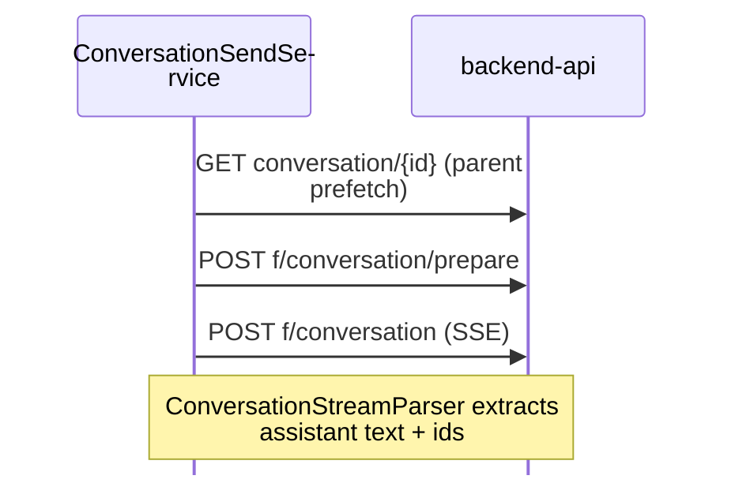

# ChatGPT Backend-API — Endpoint Reference

Complete catalog of paths defined in `ChatGptApiEndpoints.cs`. These are **undocumented ChatGPT web APIs** — paths and payloads may change without notice.

For send pipeline behavior, caches, and error handling see [chatgpt-api-integration.md](../developer/chatgpt-api-integration.md).  
For JSON shapes returned by project endpoints see [gizmo-api-response-shapes.md](gizmo-api-response-shapes.md).

*Last synced with `ChatGptApiEndpoints.cs`: 2026-07-03.*

---

## Transport

| Item | Value |
|------|-------|
| Base origin | `https://chatgpt.com` |
| Auth | Session cookies from WebView2 (`oai-did` device id required) |
| Client | Injected `chatgpt-api-bridge.js` → `apiRequest` bridge action |
| Service layer | `ChatGptProjectApiService`, `ChatGptConversationSendService` |

---

## Session

| Constant | Method | Path | Purpose |
|----------|--------|------|---------|
| `Session` | GET | `/api/auth/session` | Auth check, user id, account id |

---

## Projects (Gizmos / Snorlax)

| Constant | Method | Path | Purpose |
|----------|--------|------|---------|
| `ProjectsSidebar` | GET | `/backend-api/gizmos/snorlax/sidebar` | Sidebar project list |
| `GizmosBootstrap` | GET | `/backend-api/gizmos/bootstrap` | Bootstrap project list |
| `ProjectUpsert` | POST | `/backend-api/gizmos/snorlax/upsert` | Create/update project, attach files |
| `GizmoDetail(gizmoId)` | GET | `/backend-api/gizmos/{gizmoId}` | Project detail |
| `ProjectDetail(projectId)` | GET / PATCH | `/backend-api/projects/{projectId}` | Project settings UI (name, instructions, emoji, theme) |
| `ProjectConversations(gizmoId)` | GET | `/backend-api/gizmos/{gizmoId}/conversations` | List conversations in project |
| `ProjectFiles(gizmoId)` | GET | `/backend-api/gizmos/{gizmoId}/files` | List files (gizmo path) |
| `ProjectFilesList(gizmoId)` | GET | `/backend-api/projects/{gizmoId}/files` | List files (project path) |
| `ProjectFilesAttach(gizmoId)` | POST | `/backend-api/projects/{gizmoId}/files` | Attach uploaded file to project |

**Discovery order** (`ProjectDiscoveryService`): sidebar → bootstrap → DOM scrape.

### Project settings vs Snorlax upsert

| Surface | Path | Use when |
|---------|------|----------|
| **Settings UI API** | `GET` / `PATCH` `/backend-api/projects/{id}` | Read or update display name, instructions, emoji, theme (matches ChatGPT project settings panel) |
| **Snorlax upsert** | `POST` `/backend-api/gizmos/snorlax/upsert` | Create project, attach/detach files, full gizmo body |

`ChatGptProjectApiService.UpdateProjectSettingsAsync` uses the settings UI PATCH. File attach flows still use `UpsertProjectAsync` / `AttachProjectFilesViaUpsertAsync`.

**PATCH body (observed):**

```json
{
  "name": "Project display name",
  "instructions": "…",
  "emoji": "book",
  "theme": "#fa423e"
}
```

**PATCH response:** HTTP 200 with `resource.gizmo` (same nesting as upsert). Parsed by `ParseProjectSettings`.

---

## Files — upload & process

| Constant | Method | Path | Purpose |
|----------|--------|------|---------|
| `FilesUpload` | POST | `/backend-api/files` | Generic file upload |
| `FilesLibraryUpload` | POST | `/backend-api/files/library` | Library upload (multipart; auto-binds to gizmo) |
| `FilesProcessUploadStream` | POST | `/backend-api/files/process_upload_stream` | Stream processing after upload |

---

## Files — download

Multiple path variants exist because ChatGPT serves project sources through several URL shapes. The app tries candidates in order via `BuildFileDownloadPathCandidates` or `BuildProjectScopedDownloadPathCandidates`.

### Generic file paths

| Constant | Method | Path |
|----------|--------|------|
| `FileDownload(fileId)` | GET | `/backend-api/files/{fileId}` |
| `FileDownloadWithQuery(fileId)` | GET | `/backend-api/files/{fileId}?download=1` |

### Project-scoped paths

| Constant | Method | Path |
|----------|--------|------|
| `ProjectFileDownload(gizmoId, fileId)` | GET | `/backend-api/projects/{gizmoId}/files/{fileId}` |
| `ProjectFileDownloadWithQuery(gizmoId, fileId)` | GET | `/backend-api/projects/{gizmoId}/files/{fileId}?download=1` |
| `GizmoFileDownload(gizmoId, fileId)` | GET | `/backend-api/gizmos/{gizmoId}/files/{fileId}` |
| `GizmoFileDownloadWithQuery(gizmoId, fileId)` | GET | `/backend-api/gizmos/{gizmoId}/files/{fileId}?download=1` |

### Sources UI paths (observed from ChatGPT web UI)

| Constant | Method | Path pattern |
|----------|--------|--------------|
| `ProjectSourceFileDownload(gizmoId, fileId)` | GET | `/backend-api/files/download/{fileId}?gizmo_id={gizmoId}&inline=false&download_intent=false` |
| `ProjectSourceFileDownloadInline(gizmoId, fileId)` | GET | same with `inline=true` |
| `ProjectSourceFileDownloadWithIntent(gizmoId, fileId)` | GET | same with `download_intent=true` |
| `ProjectSourceFileDownloadIntentOnly(gizmoId, fileId)` | GET | `/backend-api/files/download/{fileId}?gizmo_id={gizmoId}&download_intent=true` |

### Metadata probe

| Constant | Method | Path | Purpose |
|----------|--------|------|---------|
| `ProjectSourceFileSimple(gizmoId, fileId)` | GET | `/backend-api/files/{fileId}/simple?gizmo_id={gizmoId}` | Lightweight metadata before download |

### Download candidate order

When `gizmoId` is set **or** file `location` is `fs`, **project paths are tried first**:

1. `ProjectSourceFileDownloadIntentOnly`
2. `ProjectSourceFileDownloadWithIntent`
3. `ProjectSourceFileDownload`
4. `ProjectSourceFileDownloadInline`
5. `ProjectFileDownloadWithQuery`
6. `ProjectFileDownload`
7. `GizmoFileDownloadWithQuery`
8. `GizmoFileDownload`
9. `FileDownloadWithQuery`
10. `FileDownload`

`BuildProjectScopedDownloadPathCandidates` uses steps 1–8 only (no generic fallbacks).

---

## Files — delete

| Constant | Method | Path | Notes |
|----------|--------|------|-------|
| `FileDelete(fileId)` | DELETE | `/backend-api/files/{fileId}` | Generic delete |
| `ProjectFileDelete(gizmoId, fileId)` | DELETE | `/backend-api/gizmos/{gizmoId}/files/{fileId}` | Gizmo-scoped |
| `ProjectFilesDelete(gizmoId)` | DELETE | `/backend-api/gizmos/{gizmoId}/files` | Delete all (gizmo) |
| `ProjectFilesFileDelete(gizmoId, fileId)` | DELETE | `/backend-api/projects/{gizmoId}/files/{fileId}` | Project path |
| `ProjectFilesCollectionDelete(gizmoId)` | DELETE | `/backend-api/projects/{gizmoId}/files` | Delete all (project) |

---

## Conversations

| Constant | Method | Path | Purpose |
|----------|--------|------|---------|
| `ConversationsCreate` | POST | `/backend-api/conversations` | Legacy create — often **405** |
| `ConversationInit` | POST | `/backend-api/conversation/init` | Session warmup; **no** conversation id |
| `ConversationGet(conversationId)` | GET | `/backend-api/conversation/{conversationId}` | Full conversation tree |
| `ConversationHide(conversationId)` | PATCH | `/backend-api/conversation/{conversationId}` | Soft-hide (`is_visible: false`) or rename (`title`) — same URL, body selects operation |
| `ConversationPrepare` | POST | `/backend-api/f/conversation/prepare` | Prepare send (parent, conduit) |
| `ConversationSend` | POST | `/backend-api/f/conversation` | **Send message — SSE stream** |

### Code interpreter / sandbox download

Two-step flow for assistant-generated sandbox files:

| Step | Constant | Path |
|------|----------|------|
| 1 | `ConversationInterpreterDownload(conversationId, messageId, sandboxPath)` | GET `/backend-api/conversation/{id}/interpreter/download?message_id=…&sandbox_path=…` |
| 2 | Follow `download_url` from envelope | estuary/content URL |

### Conversation lifecycle (PATCH)

ChatGPT uses one PATCH URL for metadata updates on an existing conversation. There is no HTTP `DELETE`.

| Operation | PATCH body | Service method | Response (observed) |
|-----------|------------|----------------|---------------------|
| Soft-delete (hide) | `{ "is_visible": false }` | `HideConversationAsync`, `DeleteConversationAsync` | HTTP 200 |
| Rename | `{ "title": "…" }` | `RenameConversationAsync` | `{ "success": true }` |

`ConversationHide(id)` and `ConversationGet(id)` resolve to the same path constant; GET fetches the tree, PATCH mutates metadata.

---

## Send pipeline (summary)



Detail: [chatgpt-api-integration.md](../developer/chatgpt-api-integration.md#conversation-send-pipeline).

---

## URL helpers (not endpoints)

`ChatGptUrls.cs` — parse ids from browser URLs, not API calls:

| Helper | Extracts |
|--------|----------|
| `TryParseConversationId(url)` | `c-{uuid}` |
| `TryParseGizmoId(url)` | Project id |
| `PathLooksLikeProjectRoute(path)` | Project page detection |
| `IsTrustedChatGptTopLevelUri(uri)` | Injection safety gate |
| `NormalizeGizmoId(id)` | Canonical gizmo id form |

---

## Diagnostics artifacts

| Component | Output path |
|-----------|-------------|
| `ChatGptApiDiscovery` | `api-client-profile.json` |
| `ProbeSidebarAsync` | `last-sidebar-probe.json` |
| `ProjectLinkDiagnostics` | `link-project.log` |
| `ProjectSyncTrace` | `sync-trace.jsonl` |
| `ChatGptApiSendSampleCapture` | `api-send-samples/` |

---

## Related

- [api-and-data-models-index.md](api-and-data-models-index.md)
- [gizmo-api-response-shapes.md](gizmo-api-response-shapes.md)
- [chatgpt-api-integration.md](../developer/chatgpt-api-integration.md)
- [webview-bridges.md](../developer/webview-bridges.md) — `apiRequest` bridge
- [services-reference.md](services-reference.md) — `ChatGptProjectApiService`
