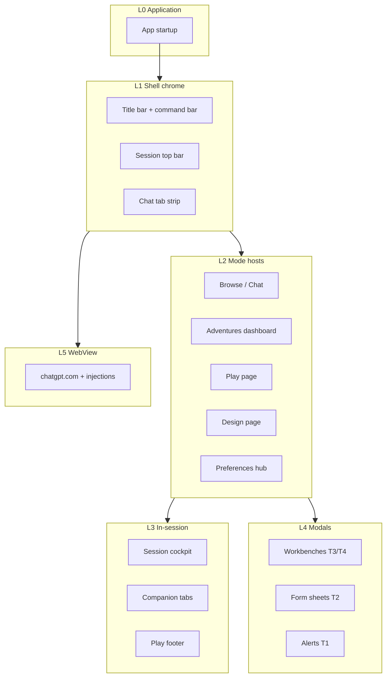

# UI Surface Catalog — End-to-End Inventory

**Status:** Living catalog (regenerate sections when XAML inventory changes)  
**Last audited:** 2026-07-09  
**Scope:** Every user-visible UI surface in ChatGPT Wrapper — shell chrome, mode hosts, in-session panels, modals, embedded panels, ephemeral UI, and WebView-adjacent overlays.

**Related:** [Wrapper UI paradigm](wrapper-ui-paradigm.md) · [UI components](ui-components.md) · [WinUI dialog redesign strategy](../plans/winui-dialog-redesign-strategy.md) · [Play Settings UI roadmap](../plans/play-settings-ui-roadmap.md)

---

## How to use this catalog

| Column | Meaning |
|--------|---------|
| **ID** | Stable catalog key (`SHELL-`, `PAGE-`, `PANEL-`, `MODAL-`, `EMBED-`, `EPHEM-`, `WEB-`, `MENU-`) |
| **Tier** | Dialog tier from [paradigm P7](wrapper-ui-paradigm.md#p7--right-chrome-for-the-job): T0 inline · T1 alert · T2 sheet · T3 hub · T4 session workbench · — for non-modals |
| **Paradigm** | Layout contract from [wrapper-ui-paradigm.md](wrapper-ui-paradigm.md): Shell · Companion · Hub · Workbench · Form · Master-detail · Browse |
| **WPF** | Path under `ChatGPTWrapper/` or **—** |
| **WinUI** | Path under `ChatGPTWrapper.WinUI/` or **—** |
| **Primary host** | Which executable path users hit today (`WinUI` default via `run.ps1`; `WPF` via `-Wpf`) |
| **Migration** | `Native` · `Workbench` · `ContentDialog` · `Picker` · `WPF-STA` · `WPF-only` · `Alias` · `Gap` |

**Counts (2026-07-09):**

| Layer | Surfaces |
|-------|----------|
| Application hosts | 2 |
| Shell chrome | 8 |
| Mode pages / hosts | 5 (+ 3 WPF legacy views) |
| In-session panels | 18 |
| Modal & workbench | 45 distinct intents |
| Dialog-internal embeds | 14 |
| Ephemeral (no dedicated XAML page) | 12 |
| Menus & flyouts (code-only) | 11 |
| WebView / injected | 6 |
| **Total cataloged** | **~111** |

---

## Layer map



---

## L0 — Application hosts

| ID | Surface | WPF | WinUI | Primary host | Notes |
|----|---------|-----|-------|--------------|-------|
| `SHELL-000` | **Application entry** | `App.xaml` | `App.xaml` | **WinUI** | Merges theme dictionaries; `run.ps1` default |
| `SHELL-001` | **Main window** | `MainWindow.xaml` | `MainWindow.xaml` | **WinUI** | Root grid: chrome · content frame · chat column · status |

### MainWindow partial regions (WPF)

Logic regions in `MainWindow.*.cs` — not separate XAML, but distinct behavioral surfaces:

| Region file | Responsibility |
|-------------|----------------|
| `MainWindow.xaml.cs` | Toolbar, View menu, Format, Preferences |
| `MainWindow.ChatTabs.cs` | WebView2 tab strip |
| `MainWindow.Adventures.cs` | Mode switch, dashboard/play/design host |
| `MainWindow.SessionChrome.cs` | Session overflow, status chips |
| `MainWindow.ShellSegments.cs` | App mode + Play/Design segments |
| `MainWindow.PlayInjection.cs` | Send, review, play settings entry |
| `MainWindow.GenerationJobs.cs` | Utility job launch |
| `MainWindow.ProjectHost.cs` | Project workspace routing |
| `MainWindow.Theme.cs` | Appearance dialog entry |
| `MainWindow.ThreadManager.cs` | Threads + browser tab picker |
| *(+ 16 more partials)* | See [ui-components.md § MainWindow](ui-components.md#mainwindow) |

---

## L1 — Shell chrome (persistent)

| ID | Surface | Tier | Paradigm | WPF | WinUI | Primary | Migration |
|----|---------|------|----------|-----|-------|---------|-----------|
| `SHELL-010` | **App mode segment** (Browse / Adventures) | — | Shell | `MainWindow` → `SegmentedControl` | `MainWindow` → `SegmentedControl` | WinUI | Native |
| `SHELL-011` | **Session context strip** (back, title, Play/Design) | — | Shell | `MainWindow` `ShellContextPanel` | `SessionTopBar.xaml` | WinUI | Native |
| `SHELL-012` | **Status chips** (Review, Link, Working) | T0 | Shell | `StatusChip` in `MainWindow` | `StatusChip` in `SessionTopBar` | WinUI | Native |
| `SHELL-013` | **View command bar** (transcript mode, Format, Appearance, Preferences) | — | Shell | View `Menu` in `MainWindow` | `ViewCommandBar.xaml` | WinUI | Native |
| `SHELL-014` | **Chat tab strip** | — | Shell | `TabControl` in `MainWindow` | `ChatTabHost.xaml` → `TabView` | WinUI | Native |
| `SHELL-015` | **Chat WebView host** | — | WebView | `WebView2` per tab | `WebView2` in `ChatTabHost` | WinUI | Native |
| `SHELL-016` | **Shell status bar** | T0 | Shell | `MainWindow` row 2 | `MainWindow` status row | WinUI | Native |
| `SHELL-017` | **Custom title bar** (Mica drag region) | — | Shell | — | `MainWindow` `TitleBarRow` | WinUI | Native |

---

## L2 — Mode pages & hosts

Surfaces swapped into the adventure/content column (or full frame for Preferences).

| ID | Surface | Paradigm | WPF | WinUI | Primary | Migration | Opens from |
|----|---------|----------|-----|-------|---------|-----------|------------|
| `PAGE-001` | **Browse** (chat-only) | Shell | Implicit when no adventure column | `BrowsePage.xaml` (placeholder) | WinUI | Native | App mode **Browse** |
| `PAGE-002` | **Adventures dashboard** | Browse | `AdventureDashboardView.xaml` | `AdventureDashboardPage.xaml` | WinUI | Native | App mode **Adventures** |
| `PAGE-003` | **Play session** | Companion | `AdventurePlayView.xaml` | `AdventurePlayPage.xaml` | WinUI | Native | Dashboard Play; mode switch |
| `PAGE-004` | **Design session** | Companion | `AdventureDesignView.xaml` | `AdventureDesignPage.xaml` | WinUI | Native | Dashboard Design; Play/Design toggle |
| `PAGE-005` | **Preferences hub** | Hub | `PreferencesHubDialog.xaml` (modal) | `PreferencesHubPage.xaml` (in-frame) | WinUI | Native | View bar · overflow **Preferences** |

---

## L3 — In-session panels

### Play session (`PAGE-003`)

| ID | Surface | Paradigm | WPF | WinUI | Primary | Migration | Notes |
|----|---------|----------|-----|-------|---------|-----------|-------|
| `PANEL-010` | **Play session cockpit** | Companion | Inline in `AdventurePlayView` | `PlaySessionCockpit.xaml` | WinUI | Native | Session / Narrator / Tools segments |
| `PANEL-011` | **Link-project banner** | T0 | Inline cockpit | `PlaySessionCockpit` | WinUI | Native | InfoBar-style CTA |
| `PANEL-012` | **Narrator controls (in-session)** | Companion | Inline cockpit combos | `WinUiNarratorBehaviorPanel` (cockpit embed) | WinUI | Native | Minimal default; full via Play settings |
| `PANEL-013` | **AI tools / utility shortcuts** | Companion | `ActionListRow` in cockpit | Cockpit action rows | WinUI | Native | Canonical Review entry via shell chip |
| `PANEL-014` | **Companion host** | Companion | `PlayRightCompanionHost.xaml` | `PlayCompanionHost.xaml` | WinUI | Native | Tab container |
| `PANEL-015` | **Reference tab** | Companion | `EntityReferencePanel` in play view | `PlayCompanionReferencePanel.xaml` | WinUI | Native | Entity list + context menu |
| `PANEL-016` | **Warnings tab** | Companion | Inline tab body in play view | `PlayCompanionHost` Warnings `ListView` | WinUI | Native | Context flyout per row |
| `PANEL-017` | **State tab** | Companion | Inline tab body + expander | `PlayCompanionHost` State cards | WinUI | Native | All-fields expander |
| `PANEL-018` | **Notes panel** | Companion | `AdventureNotesPanel.xaml` via right host | **—** | WPF | **Gap** | WinUI play page has no Notes column yet |
| `PANEL-019` | **Play footer bar** | Shell | Footer in `AdventurePlayView` | `PlayFooterBar.xaml` | WinUI | Native | Search · Export · More |
| `PANEL-020` | **Hidden composer adapter** | — | `PlayPromptComposer.xaml` | **—** | WPF | WPF-only | Sync only; native ChatGPT composer default |
| `PANEL-021` | **Canon commit bar** | T0 | `EntityCanonCommitBar.xaml` | **—** | WPF | **Gap** | Pending change-plan banner |

### Design session (`PAGE-004`)

| ID | Surface | Paradigm | WPF | WinUI | Primary | Migration | Notes |
|----|---------|----------|-----|-------|---------|-----------|-------|
| `PANEL-030` | **Design session cockpit** | Companion | Header + banners in design view | `DesignSessionCockpit.xaml` | WinUI | Native | Link · thread status |
| `PANEL-031` | **Design step tabs** | Companion | `ShellCompanionTabControlStyle` tabs | `TabView` in `AdventureDesignPage` | WinUI | Native | Concept → Review |
| `PANEL-032` | **Pipeline checklist** | Companion | Inline in `AdventureDesignView` | Inline in `AdventureDesignPage` | WinUI | Native | Canonical draft order rail |
| `PANEL-033` | **Draft scroll panel** | Companion | Scroll + step fields | Dynamic fields in design page | WinUI | Native | Schema-driven |
| `PANEL-034` | **Cast entities (inline)** | Companion | `EntityReferencePanel` embed | Partial / dynamic embed | WinUI | Partial | Shared entity list pattern |
| `PANEL-035` | **Canon commit bar** | T0 | `EntityCanonCommitBar.xaml` | **—** | WPF | **Gap** | Same control as play |

### Dashboard (`PAGE-002`)

| ID | Surface | Paradigm | WPF | WinUI | Notes |
|----|---------|----------|-----|-------|-------|
| `PANEL-040` | **Adventure grid / list** | Browse | `DataGrid` in dashboard view | `ListView` + cards in dashboard page | Primary library surface |
| `PANEL-041` | **Dashboard command bar** | Browse | Toolbar + More menu | Command bar on dashboard page | New · Play · Link · Import |
| `PANEL-042` | **Grid context menu** | MENU | Right-click menu | `MenuFlyout` | Play · Rename · Export · Link · Archive |

---

## L4 — Modal & workbench surfaces (master index)

**45 distinct user intents.** Sorted by domain.

### Global settings & shell

| ID | Surface | Tier | Paradigm | WPF dialog | WinUI surface | Host | Migration | Opens from |
|----|---------|------|----------|------------|---------------|------|-----------|------------|
| `MODAL-001` | **Preferences hub** | T3 | Hub | `PreferencesHubDialog.xaml` | `PreferencesHubPage.xaml` | In-frame (WinUI) / Workbench (WPF) | Native | ⋯ Preferences |
| `MODAL-002` | **Wrapper settings** (storage & paths) | T2 | Form | `WrapperSettingsDialog.xaml` | `WrapperSettingsPage.xaml` | Workbench | Native | Preferences → Storage |
| `MODAL-003` | **Format** (transcript typography) | T3 | Workbench | `ContinuousViewFormatDialog.xaml` | `FormatEssentialsPage` + `FormatRefinementPage` | Workbench | Native | View → Format; Preferences |
| `MODAL-004` | **Appearance & theme** | T3 | Workbench | `ThemeCustomizationDialog.xaml` | `AppearanceThemePage.xaml` | Workbench | Native | View bar; Preferences |
| `MODAL-005` | **Keyboard shortcuts** | T2 | Form | `KeyboardShortcutsDialog.xaml` | **—** | WPF dialog | **Gap** | View → Keyboard shortcuts |
| `MODAL-006` | **Libraries** (import templates) | T3 | Hub | `LibrariesDialog.xaml` | **—** | WPF dialog | **Gap** | Dashboard Libraries |

### Play settings & session

| ID | Surface | Tier | Paradigm | WPF | WinUI | Host | Migration | Opens from |
|----|---------|------|----------|-----|-------|------|-----------|------------|
| `MODAL-010` | **Play settings** (full workbench) | T4 | Workbench | `PlayPromptInjectionDialog.xaml` | `PlaySettingsWorkbenchPage.xaml` | Workbench | Native | ⚙ · Session bar · Preferences shortcuts |
| `MODAL-011` | **Source manager** | T4 | Workbench | *Alias → Sources tab* | `ShowSourceManagerAsync` → Sources tab | Workbench | Alias | Link chip · Play settings |
| `MODAL-012` | **Thread manager** | T3 | Master-detail | `AdventureThreadManagerDialog.xaml` | `ThreadManagerPage.xaml` | Workbench | Native | Session ⋯ · Preferences · Play settings |
| `MODAL-013` | **Play handoff** | T3 | Workbench | `PlayHandoffDialog.xaml` | `PlayHandoffPage.xaml` | Workbench | Native | Footer · Play settings Session |
| `MODAL-014` | **Browser tab picker** | T1 | Alert | `BrowserTabPickerDialog.xaml` | **—** | WPF dialog | **Gap** | Thread manager link flow |
| `MODAL-015` | **Context viewer** (read-only packet) | T2 | Form | `ContextViewerDialog.xaml` | **—** | WPF dialog | **Gap** | Play settings previews · flight recorder |
| `MODAL-016` | **Recap** | T2 | Form | `RecapDialog.xaml` | `RecapPage.xaml` | ContentDialog / Workbench | Native | Footer More · utility jobs preview |
| `MODAL-017` | **Search** | T3 | Master-detail | `SearchDialog.xaml` | `SearchPage.xaml` | Workbench | Native | Play footer Search |
| `MODAL-018` | **Conversation files** | T2 | Form | `ConversationFilesDialog.xaml` | **—** | WPF dialog | **Gap** | Play settings Session |
| `MODAL-019` | **Flight packet compare** | T3 | Master-detail | `FlightPacketCompareDialog.xaml` | **—** | WPF dialog | **Gap** | Play settings History |
| `MODAL-020` | **Random table roller** | T2 | Form | `RandomTableDialog.xaml` | **—** | WPF dialog | **Gap** | Play footer More |
| `MODAL-021` | **Utility job attachment launch** | T1 | Alert | `UtilityJobAttachmentLaunchDialog.cs` (code-only) | **—** | WPF dialog | **Gap** | AI tools Run |

### Play settings — nav sections (WinUI tabs / WPF tabs)

| ID | Section | WPF tab | WinUI tab | Scope |
|----|---------|---------|-----------|-------|
| `MODAL-010a` | Packet & injection | Injection / Behavior | `PlaySettingsInjectionTab` | This send |
| `MODAL-010b` | Player input / Next send | Next send | `PlaySettingsNextSendTab` | This send |
| `MODAL-010c` | Packet preview | Preview column / tab | `PlaySettingsPreviewTab` | Preview |
| `MODAL-010d` | World state | World | `PlaySettingsWorldTab` | Persistent |
| `MODAL-010e` | Narrator contract | Settings / Behavior | `PlaySettingsNarratorContractTab` | Adventure |
| `MODAL-010f` | Play surface / layout | Play surface | `PlaySettingsPlaySurfaceTab` | Chrome |
| `MODAL-010g` | Session & threads | Session | `PlaySettingsSessionTab` | Session |
| `MODAL-010h` | Sources | Sources | `PlaySettingsSourcesTab` | Project |
| `MODAL-010i` | Memory & cards | Memory & cards | `PlaySettingsMemoryCardsTab` | Persistent |
| `MODAL-010j` | Utility jobs | AI Actions | `PlaySettingsUtilityJobsTab` | Jobs |
| `MODAL-010k` | Send timeline / History | History | `PlaySettingsHistoryTab` | Read-only |

### Review & canon

| ID | Surface | Tier | Paradigm | WPF | WinUI | Migration | Opens from |
|----|---------|------|----------|-----|-------|-----------|------------|
| `MODAL-030` | **Proposal review hub** | T3 | Master-detail | `ProposalReviewHubDialog.xaml` | `ProposalReviewHubPage.xaml` | Native | Review chip · Play/Design |
| `MODAL-031` | **JSON import review** | T3 | Master-detail | `JsonImportReviewDialog.xaml` | `JsonImportReviewPage.xaml` | Native | Design review · proposal hub |
| `MODAL-032` | **Canon inbox** | T3 | Master-detail | `CanonInboxDialog.xaml` | **—** | **Gap** | Canon banners |
| `MODAL-033` | **Canon reconcile** | T2 | Form | `CanonReconcileDialog.xaml` | **—** | **Gap** | Source drift prompt |
| `MODAL-034` | **Entity change plan diff** | T2 | Form | `EntityChangePlanDiffPreviewDialog.xaml` | **—** | **Gap** | Canon commit bar |

### Project & sources

| ID | Surface | Tier | Paradigm | WPF | WinUI | Migration | Opens from |
|----|---------|------|----------|-----|-------|-----------|------------|
| `MODAL-040` | **Project workspace** | T4 | Workbench | `ProjectWorkspaceDialog.xaml` | `ProjectWorkspacePage.xaml` | Native | Dashboard Link · thread tools |
| `MODAL-041` | **Source sync** (publication lab) | T4 | Workbench | `SourceSyncDialog.xaml` | `SourceSyncPage.xaml` | Native | Play settings Sources |
| `MODAL-042` | **Source compare** | T3 | Master-detail | `SourceCompareDialog.xaml` | **—** | **Gap** | Source manager · JSON review |

### Design & authoring

| ID | Surface | Tier | Paradigm | WPF | WinUI | Migration | Opens from |
|----|---------|------|----------|-----|-------|-----------|------------|
| `MODAL-050` | **Scenario creation** | T2 | Form | `ScenarioCreationDialog.xaml` | `ScenarioCreationPage.xaml` | ContentDialog | Dashboard New |
| `MODAL-051` | **Design wizard** | T4 | Workbench | `AdventureDesignWizard.xaml` | **—** | **WPF-STA** | Dashboard Design with AI |
| `MODAL-052` | **Instruction designer** | T3 | Workbench | `InstructionDesignerDialog.xaml` | **—** | **Gap** | Design Instructions · Sources |
| `MODAL-053` | **Cast phrase import** | T2 | Form | `CastPhraseImportDialog.xaml` | **—** | **Gap** | Format highlights · Design Cast |
| `MODAL-054` | **Adventure rename** | T1 | Alert | `AdventureRenameDialog.xaml` | Inline `ContentDialog` | ContentDialog | Dashboard · session overflow |

### Entity CRUD

| ID | Surface | Tier | Paradigm | WPF | WinUI | Migration | Opens from |
|----|---------|------|----------|-----|-------|-----------|------------|
| `MODAL-060` | **Entity edit** | T3 | Workbench | `EntityEditDialog.xaml` | `EntityEditPage.xaml` | Native | Reference double-click |
| `MODAL-061` | **Entity merge** | T3 | Master-detail | `EntityMergeDialog.xaml` | `EntityMergePage.xaml` | Native | Reference context menu |
| `MODAL-062` | **Entity retire** | T2 | Form | `EntityRetireDialog.xaml` | `EntityRetirePage.xaml` | Native | Reference context menu |
| `MODAL-063` | **Entity delete** | T1 | Alert | Confirm in WPF flows | `ShowEntityDeleteAsync` | ContentDialog | Reference context menu |
| `MODAL-064` | **Entity rename wizard** | T3 | Workbench | `EntityRenameWizardDialog.xaml` | **—** | **Gap** | Rename with mention plan |

### Theme & format helpers

| ID | Surface | Tier | WPF | WinUI | Migration | Opens from |
|----|---------|------|-----|-------|-----------|------------|
| `MODAL-070` | **Theme color picker** | T1 | `ThemeColorPickerDialog.xaml` | **—** | **Gap** | Appearance / Format color fields |
| `MODAL-071` | **System font picker** | T1 | `FormatSystemFontPickerWindow.xaml` | **—** | **Gap** | Format dialog fonts |
| `MODAL-072` | **Highlight color assignment** | T2 | `HighlightColorAssignmentDialog.xaml` | **—** | **Gap** | Phrase highlights editor |
| `MODAL-073` | **Highlight color grouping** | T2 | `HighlightColorGroupingDialog.xaml` | **—** | **Gap** | Phrase highlights editor |

### Utilities & developer

| ID | Surface | Tier | WPF | WinUI | Migration | Opens from |
|----|---------|------|-----|-------|-----------|------------|
| `MODAL-080` | **Local inference lab** | T4 | `LocalInferenceLabDialog.xaml` | **—** | **WPF-STA** | Preferences · overflow |
| `MODAL-081` | **Export adventure** | T1 | WPF export UI | `FileSavePicker` | Picker | Dashboard · Play footer |
| `MODAL-082` | **Import backup** | T2 | WPF import UI | `FileOpenPicker` + validation | Picker | Dashboard Import |
| `MODAL-083` | **Generic text prompt** | T1 | `TextPromptDialog.xaml` | `PromptAsync` / inline `ContentDialog` | ContentDialog | Various callers |

### Workbench shell hosts (code-only)

| ID | Surface | WinUI path | Purpose |
|----|---------|------------|---------|
| `SHELL-020` | **WinUiShellDialogWindow** | `Shell/WinUiShellDialogWindow.cs` | Base resizable modal window |
| `SHELL-021` | **WinUiShellDialogHostWindow** | `Shell/WinUiShellDialogHostWindow.cs` | Scroll body + footer strip for T2–T4 |

---

## L5 — Dialog-internal embeds

Panels that are not top-level entry points but are distinct UI regions inside modals.

| ID | Surface | Parent modal | WPF | WinUI |
|----|---------|--------------|-----|-------|
| `EMBED-001` | Injection packet preview | Play settings | `InjectionPacketPreviewControl.xaml` | `InjectionPacketPreviewPanel.xaml` |
| `EMBED-002` | Flight recorder timeline | Play settings History | `FlightRecorderPanel.xaml` | Inline in `PlaySettingsHistoryTab` |
| `EMBED-003` | Narrator behavior (settings) | Play settings | `NarratorBehaviorPanel.xaml` | `WinUiNarratorBehaviorPanel.xaml` |
| `EMBED-004` | Section card chrome | Play settings tabs | — | `PlaySettingsSectionCard.xaml` |
| `EMBED-005` | Entity workspace tabs | Entity edit | `EntityWorkspaceHost.xaml` | — (simplified on WinUI page) |
| `EMBED-006` | Entity edit form body | Entity edit | `EntityEditFormHost.xaml` | Inline in `EntityEditPage` |
| `EMBED-007` | Entity internal state form | Entity edit | `EntityInternalStateFormHost.xaml` | **—** |
| `EMBED-008` | Entity extended fields editor | Entity edit | `EntityExtendedFieldsEditor.xaml` | **—** |
| `EMBED-009` | Phrase highlights rule list | Format | `PhraseHighlightsEditorControl.xaml` | **—** |
| `EMBED-010` | Native format preview | Format | `FormatPreviewControl.xaml` | **—** |
| `EMBED-011` | Weave format preview | Format | `WeaveFormatPreviewControl.xaml` | **—** |
| `EMBED-012` | Format refinement categories | Format | Tabs inside `ContinuousViewFormatDialog` | `FormatRefinementPage` |
| `EMBED-013` | Project workspace tabs | Project workspace | Tab items in dialog | `ProjectWorkspacePage` `TabView` |
| `EMBED-014` | Play handoff wizard steps | Play handoff | Tab/wizard in dialog | `PlayHandoffPage` `TabView` |

---

## L6 — Menus & flyouts (no dedicated XAML file)

| ID | Surface | Host | Items (representative) |
|----|---------|------|------------------------|
| `MENU-001` | **Main overflow ⋯** | WPF `MainWindow` / WinUI chrome | Preferences · Local inference lab · … |
| `MENU-002` | **View menu** | WPF `MainWindow` | Transcript modes · Format · Keyboard shortcuts |
| `MENU-003` | **Session overflow ⋯** | WPF session chrome / `SessionTopBar` | Threads · Sources · Play settings · Rename |
| `MENU-004` | **Play More actions** | `AdventurePlayView` / footer | Recap · Handoff · Sync thread log · Random table · … |
| `MENU-005` | **Dashboard New ▾** | Dashboard | New adventure · Import · … |
| `MENU-006` | **Dashboard More…** | Dashboard | Backup · Wrapper settings route · Libraries |
| `MENU-007` | **Adventure grid context** | Dashboard grid | Play · Design · Rename · Archive · Link |
| `MENU-008` | **Entity reference context** | Reference panel | Edit · Merge · Retire · Delete |
| `MENU-009` | **Warnings row flyout** | `PlayCompanionHost` | Open in Reference · Dismiss |
| `MENU-010` | **Chat tab context** | `ChatTabHost` | Close · Close others (typical) |
| `MENU-011` | **Transcript mode segment** | View menu / `ViewCommandBar` | Native · Continuous · Weave |

---

## L7 — Ephemeral UI (runtime-only)

No persistent XAML page; constructed in code.

| ID | Surface | Tier | WinUI API | WPF equivalent | Used for |
|----|---------|------|-----------|----------------|----------|
| `EPHEM-001` | Confirm dialog | T1 | `WinUiDialogService.ShowConfirmAsync` | `MessageBox` / custom | Delete confirms |
| `EPHEM-002` | Info alert | T1 | `ShowInfoAsync` | `MessageBox` | Validation messages |
| `EPHEM-003` | Custom alert | T1 | `ShowAlertAsync` | — | Rich alert content |
| `EPHEM-004` | Text prompt | T1 | `PromptAsync` | `TextPromptDialog` | Rename inputs · sync prompts |
| `EPHEM-005` | Rename adventure | T1 | `ShowRenameAsync` | `AdventureRenameDialog` | Dashboard rename |
| `EPHEM-006` | Scenario creation shell | T1 | `ContentDialog` hosting `ScenarioCreationPage` | `ScenarioCreationDialog` | New adventure |
| `EPHEM-007` | Recap shell | T1/T2 | `ContentDialog` hosting `RecapPage` | `RecapDialog` | Quick recap |
| `EPHEM-008` | Entity delete confirm | T1 | `ShowEntityDeleteAsync` | WPF confirm | Reference delete |
| `EPHEM-009` | File save picker | T1 | `FileSavePicker` | Save dialog | Export |
| `EPHEM-010` | File open picker | T1 | `FileOpenPicker` | Open dialog | Import backup |
| `EPHEM-011` | Source sync prompt | T1 | Inline `ContentDialog` in `SourceSyncPage` | — | Per-file actions |
| `EPHEM-012` | TeachingTip (planned) | T0 | WinUI `TeachingTip` | — | First-visit hints per paradigm |

---

## L8 — WebView & injected surfaces

| ID | Surface | Location | User-visible role |
|----|---------|----------|-------------------|
| `WEB-001` | **ChatGPT web app** | `chatgpt.com` in WebView2 | Primary chat UI (external DOM) |
| `WEB-002` | **Continuous view overlay** | Injected JS/CSS | Reading-mode transcript typography |
| `WEB-003` | **Weave view overlay** | Injected JS/CSS | Alternate transcript layout |
| `WEB-004` | **Play compose intercept** | `cgw-play-compose.js` | Send → host `PrepareSend` pipeline |
| `WEB-005` | **Wrapper chrome CSS** | `wrapper-overrides.css` | Scrollbars, density, `--cgw-*` tokens |
| `WEB-006` | **Adventure bridge UI** | `adventure-bridge.js` | In-page automation hooks (non-author facing) |

Transcript **typography** settings live in Format (`MODAL-003`); shell **theme** maps to `--cgw-*` via `ThemeApplicationService` / `WinUiChatGptStyleInjection`.

---

## Reusable controls (not standalone surfaces)

Shared primitives — used inside surfaces above; not cataloged as entry points.

| Control | WPF | WinUI | Role |
|---------|-----|-------|------|
| `SegmentedControl` | `Controls/SegmentedControl.xaml` | `Controls/SegmentedControl.xaml` | Mode / section toggle |
| `StatusChip` | `Controls/StatusChip.xaml` | `Controls/StatusChip.xaml` | Shell status badge |
| `ActionListRow` | `Controls/ActionListRow.xaml` | `Controls/ActionListRow.xaml` | Scannable action list |

**Theme dictionaries (not surfaces):** `Themes/WrapperTokens.xaml`, `WrapperControls.xaml`, `WrapperChrome.xaml`, `WrapperIcons.xaml` (WPF); `Themes/WrapperTokens.xaml`, `WrapperControls.xaml` (WinUI).

---

## Appendix A — Aliases, removed, and docs-only names

| Name | Actual surface | Notes |
|------|----------------|-------|
| `SourceManagerDialog` | `MODAL-011` Sources tab | No separate XAML; routes to Play settings |
| `NarratorAdvancedDialog` | `MODAL-010` Injection + cockpit | Removed; folded into Play settings |
| `PhraseHighlightsDialog` | `EMBED-009` in Format | Removed standalone dialog |
| `AdventureSettingsDialog` | `MODAL-010` | Deleted shim |
| `ProjectLinkWizard` | `MODAL-040` | Deleted; project workspace |
| `SyncFromThreadDialog` | `MENU-004` thread log sync | No dialog XAML; async prompt flow |
| `ResponseReviewDialog` | `MODAL-030` | Superseded by proposal review hub |
| `EditTurnDialog` | Continuous view surrogate | Superseded |

---

## Appendix B — Migration status summary

**WinUI primary host (`run.ps1` default):**

| Migration | Count | Surfaces |
|-----------|------:|----------|
| **Native WinUI** | 38 | Shell, pages, play settings workbench, most workbenches |
| **ContentDialog / Picker** | 8 | Rename, scenario, recap, delete, export, import, prompts |
| **WPF-STA modal** | 2 | Design wizard (`MODAL-051`), Local inference lab (`MODAL-080`) |
| **Gap** (WPF-only or missing WinUI) | 22 | See table below |

### WinUI gaps (still WPF or missing)

| ID | Surface | Priority wave |
|----|---------|---------------|
| `MODAL-005` | Keyboard shortcuts | W1 |
| `MODAL-006` | Libraries | W4 |
| `MODAL-014` | Browser tab picker | W1 |
| `MODAL-015` | Context viewer | W3 |
| `MODAL-018` | Conversation files | W3 |
| `MODAL-019` | Flight packet compare | W4 |
| `MODAL-020` | Random table | W4 |
| `MODAL-021` | Utility job attachment | W3 |
| `MODAL-032`–`034` | Canon inbox / reconcile / diff | W3 |
| `MODAL-042` | Source compare | W3 |
| `MODAL-052`–`053` | Instruction designer · cast phrase import | W3–W4 |
| `MODAL-064` | Entity rename wizard | W2 |
| `MODAL-070`–`073` | Theme/format picker helpers | W1–W2 |
| `PANEL-018` | Notes panel | W2 (play parity) |
| `PANEL-021` / `035` | Canon commit bar | W2 |
| `EMBED-007`–`011` | Entity internal state · format previews · highlights | W1–W2 |

**WPF-only host (`run.ps1 -Wpf`):** All WPF XAML surfaces remain available; 66 XAML files in `ChatGPTWrapper/`.

---

## Appendix C — Entry-point routing (WinUI)

`WinUiDialogHostService` / `WinUiDialogService` methods → catalog IDs:

| Method | Catalog ID(s) |
|--------|---------------|
| `ShowPlaySettingsAsync` | `MODAL-010` |
| `ShowSourceManagerAsync` | `MODAL-011` |
| `ShowThreadManagerAsync` | `MODAL-012` |
| `ShowPlayHandoffAsync` | `MODAL-013` |
| `ShowRecapAsync` | `MODAL-016` |
| `ShowSearchAsync` | `MODAL-017` |
| `ShowProposalReviewAsync` | `MODAL-030` |
| `ShowJsonImportReviewAsync` | `MODAL-031` |
| `ShowProjectWorkspaceAsync` | `MODAL-040` |
| `ShowSourceSyncWorkbenchAsync` | `MODAL-041` |
| `ShowFormatDialogAsync` | `MODAL-003` |
| `ShowThemeCustomizationAsync` | `MODAL-004` |
| `ShowEntityEditAsync` | `MODAL-060` |
| `ShowEntityMergeAsync` | `MODAL-061` |
| `ShowEntityRetireAsync` | `MODAL-062` |
| `ShowEntityDeleteAsync` | `MODAL-063` |
| `ShowWrapperSettingsAsync` | `MODAL-002` |
| `ShowScenarioCreationAsync` | `MODAL-050` |
| `ShowRenameAsync` | `MODAL-054` |
| `ShowExportAsync` | `MODAL-081` |
| `ShowImportBackupAsync` | `MODAL-082` |
| `PromptAsync` | `MODAL-083` |
| `WpfDialogHostService.ShowDesignWizardAsync` | `MODAL-051` |
| `WpfDialogHostService.ShowLocalInferenceLabAsync` | `MODAL-080` |

---

## Maintenance

Update this catalog when:

- A new `.xaml` file is added under `ChatGPTWrapper/` or `ChatGPTWrapper.WinUI/`
- A dialog is ported from WPF to WinUI (change **Migration** column)
- An alias is removed or a surface is retired (Appendix A)
- A WinUI gap is closed (remove from Appendix B)
- A T3/T4 surface completes paradigm alignment (update [ui-paradigm-qa-matrix.md](../developer/ui-paradigm-qa-matrix.md))

**Verification commands:**

```powershell
# WPF XAML count
(Get-ChildItem -Recurse ChatGPTWrapper -Filter *.xaml).Count

# WinUI XAML count
(Get-ChildItem -Recurse ChatGPTWrapper.WinUI -Filter *.xaml).Count

# ShellDialogWindow subclasses
rg "class \w+ : ShellDialogWindow" ChatGPTWrapper --glob *.cs
```

Also sync: [ui-components.md](ui-components.md) · [winui-dialog-redesign-strategy.md §7](../plans/winui-dialog-redesign-strategy.md) · [wrapper-ui-paradigm.md § Surface alignment matrix](wrapper-ui-paradigm.md#surface-alignment-matrix).

---

*This catalog is the authoritative inventory of wrapper UI surfaces. For layout and alignment rules, see [wrapper-ui-paradigm.md](wrapper-ui-paradigm.md). For per-dialog port waves and enrichment, see [winui-dialog-redesign-strategy.md](../plans/winui-dialog-redesign-strategy.md).*
