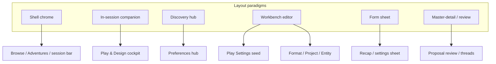

# Wrapper UI Paradigm — Cross-Surface Alignment Canon

**Status:** Design canon (normative for new UI; reference for migrations)  
**Last updated:** 2026-07-09  
**Synthesized from:** [Play Settings UI roadmap](../plans/play-settings-ui-roadmap.md) · UI modernization session (2026-07-04 — region map, Phase 4 visual system, WinUI path selection) · [play-surface UX modernization ADR](../adr/play-surface-ux-modernization-adr.md) · [WinUI shell migration ADR](../adr/winui-shell-migration-adr.md) · [WinUI dialog redesign strategy](../plans/winui-dialog-redesign-strategy.md) · [settings UX taxonomy](../settings/settings-ux-taxonomy.md)

**Related:** [UI surface catalog](ui-surface-catalog.md) · [UI components](ui-components.md) · [appearance & theme](../settings/appearance-theme-settings.md) · [Play Settings UI roadmap](../plans/play-settings-ui-roadmap.md)

---

## Purpose

This document is the **single alignment canon** for ChatGPT Wrapper user interface work. It unifies:

1. **Visual language** — Fluent-aligned tokens, elevation, typography, density (Phase 4 design system on WinUI 3)
2. **Information architecture** — one intent per entry point, scope visibility, progressive disclosure ([CMD-415](https://linear.app/cmd0112/issue/CMD-415), [CMD-262](https://linear.app/cmd0112/issue/CMD-262))
3. **Layout paradigms** — shell chrome, companion panels, hubs, workbenches, form sheets, master-detail review
4. **Component kit** — shared primitives (`Shell*`, `StatusChip`, `ActionListRow`, workbench shell)
5. **Platform contract** — WinUI 3 as long-term host; resizable `WinUiShellDialogWindow` for Tier 2+; WPF legacy frozen

Engineers, designers, and agents should treat this as the **decision tree** before adding or porting any surface. Surface-specific backlogs (Play Settings waves, dialog inventory) implement details; this doc defines **what “aligned” means**.

---

## Executive summary

| Layer | What changed | What “modern” means now |
|-------|--------------|-------------------------|
| **Phase 3 (CMD-415)** | Structure & IA | Deduped chrome, segmented controls, action lists, density tiers, companion restore |
| **Phase 4 (visual)** | Design language | Elevation over hairline borders, type scale, motion, Fluent primitives, Mica shell |
| **Platform (CMD-478)** | WinUI 3 host | First-party Fluent controls, `NavigationView`, `InfoBar`, native animations |
| **Workbench (CMD-570/579)** | Multi-section editors | Nav rail + section cards + scope badges + footer dirty state — seeded in Play Settings |

**Bottom line:** Modernization is not one visual refresh. It is a **component kit + IA + layout paradigm** program, delivered on **WinUI 3**, with **Play Settings** as the reference workbench implementation.

---

## Principles

These principles apply to **every** wrapper surface — shell, in-session panels, dialogs, hubs, and browse views.

### P1 — One intent, one primary home

Align with [settings-ux-taxonomy §3](../settings/settings-ux-taxonomy.md) and [play-surface ADR](../adr/play-surface-ux-modernization-adr.md).

| Rule | Example |
|------|---------|
| Each user intent has exactly **one primary** chrome entry | Review → shell `StatusChip`; Play settings → footer/cockpit; not also duplicate header buttons |
| Secondary paths allowed via **⋯** menu or hub shortcuts | Preferences → Play behavior opens Play settings on `Settings` tab |
| Entry points pass **deep-link id** (tab/section enum) | `ShowPlaySettingsAsync(..., PlaySettingsTab.World)` — never generic “open settings” |

### P2 — Scope is always visible

Users must know **what a change affects** before editing.

| Scope label | Meaning | Typical store |
|-------------|---------|---------------|
| **This send** | Next packet only; may not persist | `playTurnOverrides` |
| **Preview** | Read-only / staging view | — |
| **Persistent** | Saved in adventure; future sends | `adventure.json` state |
| **Adventure** | `adventure.json` settings / contract | `settings` |
| **Project** | ChatGPT Project linkage | project connection |
| **Session** | Thread pins, snapshots, drafts | session records |
| **Jobs** | Utility worker instructions | job overrides |
| **Chrome** | `ui-chrome.json` play layout | global/adventure chrome |
| **Read-only** | History / audit | flight recorder |

**Implementation:** Scope badge on nav item, section header, and `ShellSectionCard`. Semantic color per scope (token-driven).

### P3 — Preview and diff are destinations, not chrome

Heavy read-only panes are **nav sections** or child windows — not permanent side columns.

| Surface | Pattern |
|---------|---------|
| Packet preview | Play settings → **Packet preview** section (not persistent right column) |
| Source compare | Dedicated compare window / section |
| Job instruction preview | Expander or sub-pane within Utility jobs |
| Format live preview | Dedicated preview zone in Format workbench |
| Proposal diff | Review workbench detail pane |

### P4 — Progressive disclosure tiers

From [settings-ux-taxonomy §4](../settings/settings-ux-taxonomy.md):

| Tier | Audience | Placement pattern |
|------|----------|-------------------|
| **Essential** | All users | Top of hub / first nav group / Essentials tab |
| **Common** | Regular players | Primary nav groups, default-expanded cards |
| **Advanced** | Power users | Collapsed `Expander`, **Advanced** nav group |
| **Developer** | Maintainers | Advanced group, debug expanders, packet preview |

**UI pattern:** `Expander` with `ShellSectionCard` header, or nav group **Advanced** collapsed by default.

### P5 — Token-driven visuals only

All new UI uses `WrapperTokens.xaml` + `WrapperControls.xaml` (WinUI: `ChatGPTWrapper.WinUI/Themes/`) — no ad-hoc hex except semantic warnings.

| Avoid | Use instead |
|-------|-------------|
| `#32323A`, `FontSize="11"` | `BgSurfaceBrush`, `FontSizeHint`, `SpaceMd` |
| `GroupBox` with bottom border | `ShellCardStyle` + `ShellSectionHeaderStyle` |
| `ModeButtonStyle` clusters | `SegmentedControl` |
| Equal-weight button banks | `ActionListRow` |
| Plain `Border` status strips | `InfoBar` + `StatusChip` |

Runtime theme: `ThemeApplicationService` maps `ui-chrome.json` → resource keys; WebView `--cgw-*` stays in sync ([appearance-theme-settings.md](../settings/appearance-theme-settings.md)).

### P6 — Explicit save model (workbenches & editors)

| State | UX |
|-------|-----|
| Staging | Edits live in memory until **Save** |
| Dirty | Header unsaved badge + footer summary (`BuildStagingEditsSummary`) |
| Preview impact | Staging banner when unsaved edits affect packet merge |
| Close guard | Confirm on Cancel/X when dirty |
| Drill-down | Footer edit list → `HyperlinkButton` → jump to owning nav section |

Form sheets (T2) may use immediate apply per field; workbenches (T3/T4) use explicit Save/Cancel footer in `WinUiShellDialogHostWindow`.

### P7 — Right chrome for the job

From [winui-dialog-redesign-strategy §4](../plans/winui-dialog-redesign-strategy.md):

| Tier | Host | Resizable | Use when |
|------|------|-----------|----------|
| **T0** Inline | `InfoBar`, panel inline | N/A | Save confirmation, probe status |
| **T1** Alert | `ContentDialog` | No | Confirm delete, rename, single prompt |
| **T2** Form sheet | `WinUiShellDialogWindow` | **Yes** | Wrapper settings, recap, scenario creation |
| **T3** Hub / workbench | `WinUiShellDialogWindow` + nav | **Yes**, min ~900×600 | Preferences, Format, Review, Threads |
| **T4** Session workbench | `WinUiShellDialogWindow` + nav rail | **Yes**, min ~1000×700 | Play settings, Project workspace, Design wizard |

**Rule:** Tabs, grid, or preview pane → **T3 or T4**, never T1 `ContentDialog`.

### P8 — Scroll-safe layout

Port WPF scroll contract to WinUI ([ui-components.md § WPF scroll](../reference/ui-components.md#wpf-scroll--overflow-layout-contract-cmd-278--cmd-285), [CMD-565](https://linear.app/cmd0112/issue/CMD-565)):

- Body scroll host in `Grid` `*` row
- Per-tab `ShellTabScrollViewerStyle` equivalent
- No nested wheel traps on multiline fields
- Preview tabs that need viewport fill: disable outer scroll when active (Play Settings Preview pattern)

### P9 — WinUI enrichment (Tier 2+)

Each Tier 2+ surface adopts ≥1 native affordance ([dialog strategy §6](../plans/winui-dialog-redesign-strategy.md)):

`InfoBar` · `TeachingTip` · `NavigationView` compact · `BreadcrumbBar` · `AutoSuggestBox` filter · keyboard accelerators (Ctrl+S) · `FolderPicker` / `FileOpenPicker` · live WebView preview where settings affect chat CSS

### P10 — No new WPF UI

Per [winui-shell-migration-adr](../adr/winui-shell-migration-adr.md): new surfaces ship in **WinUI only**; WPF receives bugfixes until Phase 6 cutover ([CMD-517](https://linear.app/cmd0112/issue/CMD-517)).

---

## Visual design system (Phase 4)

Phase 3 ([CMD-415](https://linear.app/cmd0112/issue/CMD-415)) fixed crowding and duplication. Phase 4 fixes **visual language** on WinUI 3 ([CMD-478](https://linear.app/cmd0112/issue/CMD-478)).

### Surface model — elevation over borders

| Tier | Token direction | Use |
|------|-----------------|-----|
| **Base** | `BgBaseBrush` | Window background, Mica underlay |
| **Raised** | `BgSurfaceBrush`, subtle tint | Cards, companion body, dialog content |
| **Overlay** | `BgElevatedBrush`, `PopupBrush` | Toolbars, flyouts, teaching tips |
| **Inset** | `BgInsetBrush` | Code blocks, preview wells, monospace dumps |

Prefer **contrast and 8px radius** over 1px box-in-box outlines. Reserve `BorderSubtleBrush` for dividers between regions, not every nested panel.

### Typography scale

| Role | Style direction |
|------|-----------------|
| **Page title** | 20–24px semibold — workbench header, dialog title |
| **Section title** | `ShellSectionHeaderStyle` — 14–16px semibold |
| **Body** | 14px Comfortable / 12px Compact — density-driven |
| **Hint / caption** | `ShellSectionHintStyle`, `TextMutedBrush` |
| **Monospace** | `ShellCodeBoxStyle` / `PlaySettingsCodeBoxStyle` → `ShellCodeBoxStyle` |

Density tiers change **type rhythm and control height**, not margins alone (`ThemeDensityProfiles`).

### Icon rules ([CMD-422](https://linear.app/cmd0112/issue/CMD-422))

| Surface | Pattern |
|---------|---------|
| Shell View / ⋯ / Focus | Icon-only + tooltip |
| Play footer | `ShellIconLabelButtonStyle` — labels hidden at Compact |
| Companion tabs | Icon + label |
| Workbench nav | Icon + label + scope badge |
| AI / utility rows | `ActionListRow` text-primary; optional `LeadingIcon` |

Glyphs: Segoe Fluent / MDL2 via `WrapperIcons.xaml`.

### Motion & states

- Segmented control: animated selection indicator (WinUI `SelectorBar` or custom)
- List rows: hover fill (`RowHoverBrush`), selection (`RowSelectedBrush`) — not bordered boxes
- Workbench nav: subtle selection pill

### Scope badge tokens (P2)

Semantic scope labels use paired background + foreground brushes in `ChatGPTWrapper.WinUI/Themes/WrapperTokens.xaml`. Apply via `ScopeBadgeView` or `ScopeBadgePalette.Apply` — not ad-hoc colors on `ShellBadgeStyle`.

| Scope label | Background token | Foreground token |
|-------------|------------------|------------------|
| **This send** / **Next send** | `ScopeBadgeThisSendBackgroundBrush` | `ScopeBadgeThisSendForegroundBrush` |
| **Preview** | `ScopeBadgePreviewBackgroundBrush` | `ScopeBadgePreviewForegroundBrush` |
| **Persistent** | `ScopeBadgePersistentBackgroundBrush` | `ScopeBadgePersistentForegroundBrush` |
| **Adventure** | `ScopeBadgeAdventureBackgroundBrush` | `ScopeBadgeAdventureForegroundBrush` |
| **Project** | `ScopeBadgeProjectBackgroundBrush` | `ScopeBadgeProjectForegroundBrush` |
| **Session** | `ScopeBadgeSessionBackgroundBrush` | `ScopeBadgeSessionForegroundBrush` |
| **Jobs** | `ScopeBadgeJobsBackgroundBrush` | `ScopeBadgeJobsForegroundBrush` |
| **Chrome** | `ScopeBadgeChromeBackgroundBrush` | `ScopeBadgeChromeForegroundBrush` |
| **Read-only** | `ScopeBadgeReadOnlyBackgroundBrush` | `ScopeBadgeReadOnlyForegroundBrush` |
| **Developer** (disclosure tier) | `ScopeBadgeDeveloperBackgroundBrush` | `ScopeBadgeDeveloperForegroundBrush` |
| *(unknown)* | `ScopeBadgeDefaultBackgroundBrush` | `ScopeBadgeDefaultForegroundBrush` |

Chrome style: `ScopeBadgeStyle` in `WrapperControls.xaml` (based on `ShellBadgeStyle`, semantic fill applied in code).
- TeachingTips on first visit per section ([CMD-264](https://linear.app/cmd0112/issue/CMD-264) hub v2 tie-in)

---

## Layout paradigms

Six repeatable layout contracts cover all wrapper surfaces. Pick **one primary paradigm** per surface; combine only where noted.



### 1. Shell chrome

**Applies to:** `MainWindow` / WinUI `NavigationView` host, session top bar, chat tab strip.

```
┌─────────────────────────────────────────────────────────────┐
│ ← Title    [Play|Design]     [Review 3] [Link] [Working]  👁 ⋯│
└─────────────────────────────────────────────────────────────┘
```

| Element | Primitive |
|---------|-----------|
| Mode switch | `SegmentedControl` in `ShellCardStyle` |
| Status | `StatusChip` (Review, Link attention, Running job) |
| Commands | Unified session bar — **no** duplicate `AdventurePlayView` header |
| Transcript modes | View menu / command bar — segmented inside flyout |

**Reference:** [play-surface ADR Decision 5](../adr/play-surface-ux-modernization-adr.md) · [CMD-421](https://linear.app/cmd0112/issue/CMD-421)

### 2. In-session companion

**Applies to:** `AdventurePlayView`, `AdventureDesignView`, `PlayRightCompanionHost`.

| Region | Pattern |
|--------|---------|
| Session cockpit | `SegmentedControl` (Session / Narrator / Tools) in one `ShellCardStyle` |
| Narrator | Progressive panel: minimal default → full via Play settings Injection |
| AI tools | `ActionListRow` list — not `WrapPanel` of equal buttons |
| Companion tabs | `ShellCompanionTabControlStyle` — icon + label; last-used restore ([CMD-418](https://linear.app/cmd0112/issue/CMD-418)) |
| Side panels | `PlayLayoutCoordinator` breakpoints + density preset |
| Footer | `ShellCommandBarStyle` — Search, Export, More |

Design companion: same primitives; **not** merged with Play ([play-design convergence ADR](../adr/play-design-surface-convergence-adr.md)).

### 3. Discovery hub

**Applies to:** `PreferencesHubDialog`, future dashboard discovery cards.

| Pattern | Detail |
|---------|--------|
| Card grid on elevated background | Grouped by taxonomy category |
| Scope badges on cards | Global / Adventure shortcut |
| Rows | `ActionListRow` for scannable entries with hint + action |
| Shortcuts | Open contextual workbench with `initialTab` — not duplicate editors |

**Target host:** T3 `WinUiShellDialogWindow` ([CMD-552](https://linear.app/cmd0112/issue/CMD-552)).

### 4. Workbench editor (canonical multi-section surface)

**Reference implementation:** `PlaySettingsWorkbenchPage` ([play-settings-ui-roadmap](../plans/play-settings-ui-roadmap.md)).

```
┌ Header: context strip + unsaved badge ─────────────────────┐
├ Nav rail ──┬─ Scrollable content (section cards) ─────────┤
│ [filter]   │  ┌ ShellSectionCard ─────────────────────┐   │
│ Group      │  │ Title · scope badge · hint            │   │
│  • Section │  │ [fields]                              │   │
│  • Section │  └───────────────────────────────────────┘   │
├────────────┴───────────────────────────────────────────────┤
│ Footer: Save · Cancel · status icon · edit drill-down      │
└────────────────────────────────────────────────────────────┘
```

| Part | Current | Target (shared kit) |
|------|---------|---------------------|
| Shell | `PlaySettingsWorkbenchPage` | `ShellWorkbenchPage` |
| Section card | `PlaySettingsSectionCard` | `ShellSectionCard` |
| Nav item | `PlaySettingsNavItem` | `ShellNavItem` |
| Nav filter | `NavSearchBox` | `ShellNavFilterBehavior` |
| Footer | Inline status | `WorkbenchStatusBar` |
| Code / packet | `PlaySettingsCodeBoxStyle` | `ShellCodeBoxStyle` |
| Preview | `InjectionPacketPreviewPanel` | `PacketPreviewPanel` |

**Responsive breakpoints** (shell width):

| Width | Behavior |
|-------|----------|
| ≥ 880px | 232px nav rail + content column |
| 720–879px | 200px nav rail + content column |
| < 720px | Collapsible nav overlay / top `NavigationView` pane — follow-up |

**Workbench content width contract** — T4 workbenches are **not** T2 form sheets. The content column uses a **per-section layout mode** (seed: `PlaySettingsWorkbenchLayout`):

| Mode | Use when | Wide behavior |
|------|----------|---------------|
| **Form column** | Dense field editors (Injection, Next send, …) | Max ~720px, **left-aligned** — dead space on the right, not a centered column |
| **Card grid** | Multiple independent section cards (Session, Sources) | Pair cards 2-up when content width ≥ 880px; span full width for list-heavy cards |
| **Master-detail** | List + detail panes (Utility jobs, Memory, History) | Stretch to `*` content width |
| **Full bleed** | Preview / diff surfaces | Disable outer scroll; fill viewport |

**Anti-pattern:** A global `MaxWidth="720"` on the workbench scroll host — caps every tab including master-detail and preview.

**Workbench open viewport** — Tier 2–4 windows resolve a **design size** from the owner monitor work area before first paint (`WorkbenchViewportDesign` in `ChatGPTWrapper.Shell`). User-resized bounds in `DialogLayoutStore` still win on subsequent opens.

| Step | Behavior |
|------|----------|
| 1 | Read work area from owner window (or primary display) |
| 2 | Classify **Compact** (&lt;1280×800), **Standard**, or **Spacious** (≥1920 width) |
| 3 | Compute design W×H: ratio of work area, clamped to tier min/max |
| 4 | Apply via `WinUiDialogViewportLayout.ApplyOpenLayout` (persisted size overrides when valid) |
| 5 | Pass viewport class into page layout (`PlaySettingsViewportMetrics`) to tune form column width, nav rail, card-grid breakpoints |

| Tier | Compact example (1280×720) | Standard (1600×900) | Spacious (1920×1080) |
|------|---------------------------|---------------------|----------------------|
| **T4 session** (Play settings) | ~1040×820 open; 680px form column | ~1240×900; 720px form | ~1440×980; 800px form |

**Code:** `WorkbenchViewportDesign.cs` · `PlaySettingsWorkbenchViewport.cs` · `WinUiDialogHostService.ShowPlaySettingsAsync`

**Play Settings reference:** [play-settings-ui-roadmap § P7](../plans/play-settings-ui-roadmap.md) · [CMD-623](https://linear.app/cmd0112/issue/CMD-623)

**Rollout targets ([CMD-579](https://linear.app/cmd0112/issue/CMD-579)):**

| Surface | Nav sections (illustrative) |
|---------|----------------------------|
| Play settings | Shipped — catalog in roadmap §2 |
| Format dialog | Essentials · Refine · Advanced · Preview ([CMD-554](https://linear.app/cmd0112/issue/CMD-554)) |
| Preferences hub | Cards → open workbench section with same scope badges |
| Proposal review | Category nav + list + diff (partial today) |
| Project workspace | Connection · Projects · Sources |
| Entity edit | Profile · Sources · Mentions · History |
| Design wizard | Step nav (Cast → Lexicon → …) |
| Thread manager | Registry list + detail + handoff |

### 5. Form sheet (T2)

**Applies to:** Recap, scenario creation, wrapper settings, small wizards.

- Single-column scroll in `*` row
- `ShellFormScrollViewerStyle` / WinUI body `ScrollViewer`
- Footer in host window — Save/Cancel or Close
- Min sizes: theme `DialogMinWidthSmall/Medium` keys

### 6. Master-detail / review

**Applies to:** Proposal review hub, thread manager, source compare, entity merge.

| Column | Content |
|--------|---------|
| Master | Filterable list (`AutoSuggestBox`), category nav, status chips |
| Detail | Diff pane, monospace dump, or form |
| Split | Persisted ratio via `DialogLayoutStore` |

Shared target: `ReviewWorkbench` control family (JSON import review, flight compare).

### 7. Browse / dashboard (deferred anchor)

**Applies to:** `AdventureDashboardView` — [CMD-110](https://linear.app/cmd0112/issue/CMD-110).

First-impression surface for visual refresh:

| Region | Target |
|--------|--------|
| List | Card grid or rich `ListView` rows — not plain `DataGrid` |
| Toolbar | Primary left; More overflow; mirror shell command bar |
| Empty state | Illustration + single CTA |
| Filters | `SegmentedControl` or chip filters |

WinUI Phase 3 delivers native dashboard ([CMD-478](https://linear.app/cmd0112/issue/CMD-478) gate).

---

## Component kit

### Shell primitives (shipped / extending)

| Component | Purpose |
|-----------|---------|
| `SegmentedControl` | Single-selection mode toggle |
| `StatusChip` | Clickable status badge with optional count |
| `ActionListRow` | Scannable action: title, hint, Run, `DisabledReason`, optional `LeadingIcon` |
| `ShellCardStyle` | Grouped chrome region |
| `ShellSectionHeaderStyle` / `ShellSectionHintStyle` | Section title + muted helper |
| `ShellCommandBarStyle` | Horizontal command row |
| `ShellBadgeStyle` | Semantic badges |
| `ShellCompanionTabControlStyle` | Companion tab strip + card body |

### Workbench kit (extracting — [CMD-579](https://linear.app/cmd0112/issue/CMD-579))

| Component | Status |
|-----------|--------|
| `ShellSectionCard` | From `PlaySettingsSectionCard` |
| `ShellWorkbenchPage` | Nav + header + footer + dirty orchestration |
| `ShellNavItem` | Scope, group, filter, deep-link id |
| `WorkbenchStatusBar` | Save status + edit count + drill-down |
| `ScopeBadgeStyle` / `ScopeBadgeView` | Semantic colors per scope label (P2) |
| `PacketPreviewPanel` | Injection-agnostic preview host |

### WinUI-native controls (prefer over custom when equivalent)

`InfoBar` · `TeachingTip` · `ToggleSwitch` · `NavigationView` · `BreadcrumbBar` · `AutoSuggestBox` · `NumberBox` · `CalendarDatePicker` · `MenuFlyout` with icon items

### Legacy replacements (migration checklist)

| Legacy | Replace with |
|--------|--------------|
| `ModeButtonStyle` clusters | `SegmentedControl` |
| `WrapPanel` job buttons | `ActionListRow` |
| Duplicate Review/Settings buttons | `StatusChip` + session ⋯ |
| `GroupBox` | `ShellSectionCard` |
| Plain `Border` readiness | `InfoBar` |
| `ContentDialog` for large editors | `WinUiShellDialogWindow` |
| 9 equal tabs | Grouped nav + Advanced section |
| Persistent preview column | Dedicated preview nav section |

---

## Surface alignment matrix

| Surface | Tier | Layout paradigm | Scope badges | Preview pattern | Epic / doc |
|---------|------|-----------------|--------------|-----------------|------------|
| Main shell | — | Shell chrome | — | — | CMD-478, CMD-421 |
| Play companion | — | Companion | Session chips | Inline injection expander | CMD-415 |
| Design companion | — | Companion | — | Pipeline checklist | CMD-210 |
| Preferences hub | T3 | Hub | On cards | — | CMD-264, CMD-552 |
| Play settings | T4 | **Workbench** | All sections | Packet preview section | CMD-570, roadmap |
| Format dialog | T3 | Workbench | Per-mode | Live WebView pane | CMD-554, CMD-306 |
| Appearance / theme | T3 | Workbench tabs | Global | Shell preview strip | CMD-491 |
| Review proposals | T3 | Master-detail | Source filter | Diff detail | CMD-552 |
| Entity edit | T3 | Workbench tabs | Entity scope | Sources diff | CMD-515 |
| Project workspace | T4 | Workbench | Project | Optional WebView | CMD-515 |
| Source sync | T4 | Workbench | Project | Diagnostics list | CMD-515 |
| Thread manager | T3 | Master-detail | Session | Handoff preview | CMD-552 |
| Design wizard | T4 | Workbench steps | Adventure | Step validation InfoBar | CMD-508+ |
| Dashboard | — | Browse cards | Adventure status | — | CMD-110 |
| Recap / export | T2 | Form sheet | — | — | CMD-552 |
| Confirm / prompt | T1 | Alert | — | — | `ContentDialog` only |

---

## Platform & dialog routing

```
WinUiDialogService
├── ShowAlert / Confirm / Prompt     → ContentDialog (T1)
├── ShowSheet<TPage>               → WinUiShellDialogWindow (T2)
└── ShowWorkbench<TPage>           → WinUiShellDialogWindow (T3/T4)
```

| Concern | Contract |
|---------|----------|
| Size persist | `DialogLayoutStore` / `dialog-layouts.json` — shared schema WPF→WinUI |
| Open clamp | `WinUiDialogViewportLayout.ApplyOpenLayout` |
| Modal owner | Disable owner HWND; no nested `ContentDialog` stacks |
| Footer | Host window row — not duplicated in page XAML |
| Theme | `WrapperTokens` + `ThemeApplicationService` WinUI path |

**Anti-pattern:** Shrinking WPF 9-tab editor into fixed `ContentDialog` — caused mishapen-content regression ([dialog strategy §1](../plans/winui-dialog-redesign-strategy.md)).

---

## Implementation ladder

```mermaid
%%{init: {"flowchart":{"nodeSpacing":40,"rankSpacing":48,"padding":12},"themeVariables":{"fontSize":"12px"}} }%%
flowchart LR
  A[Phase 3 IA CMD-415] --> B[WinUI shell CMD-478]
  B --> C[Dialog T2-T4 CMD-552]
  C --> D[Play Settings workbench CMD-570]
  D --> E[Shell kit extract CMD-579]
  E --> F[Surface rollout Format Prefs Review]
  F --> G[Dashboard CMD-110]
```



| Stage | Outcome | Key issues |
|-------|---------|------------|
| **IA foundation** | Deduped chrome, primitives, companion behavior | CMD-415, CMD-417–422 |
| **WinUI host** | Mica shell, WebView tabs, NavigationView | CMD-478 |
| **Dialog program** | Resizable windows, enrichment catalog | CMD-552, CMD-515, CMD-565 |
| **Workbench seed** | Play Settings parity + nav IA | CMD-570, CMD-560 |
| **Kit extraction** | `ShellSectionCard`, `ShellWorkbenchPage` | CMD-579, CMD-580–583 |
| **Rollout pilot** | Format or Preferences section | CMD-582 |
| **Browse refresh** | Dashboard card grid | CMD-110 |

---

## Definition of done — “paradigm aligned”

A surface is **aligned** when it meets **all** applicable criteria:

### Universal

- [ ] Uses semantic tokens only (P5)
- [ ] Primary entry is unique for its intent (P1)
- [ ] Correct dialog tier and host (P7)
- [ ] Scroll contract satisfied (P8)
- [ ] WinUI-native implementation (P10) or documented island with exit issue

### Settings / editors

- [ ] Scope badge visible on every editable section (P2)
- [ ] Progressive disclosure tier respected (P4)
- [ ] Preview/diff in dedicated section if heavy (P3)

### Workbenches (T3/T4 multi-section)

- [ ] Header context strip + dirty badge
- [ ] Left nav (or `NavigationView`) with filter for 5+ sections
- [ ] All bodies use `ShellSectionCard` (or successor)
- [ ] Footer: Save/Cancel, status, edit drill-down (P6)
- [ ] Deep links from hub/cockpit pass section id
- [ ] Responsive at 1280×720 and 1920×1080 (workbench layout modes — [CMD-623](https://linear.app/cmd0112/issue/CMD-623))
- [ ] ≥1 WinUI enrichment (P9)

### Hubs

- [ ] Card rhythm matches Preferences hub
- [ ] Shortcuts open workbenches — not duplicate forms

---

## Anti-patterns (do not ship)

| Anti-pattern | Why |
|--------------|-----|
| Hairline border around every nested panel | Reads as dated WPF; use elevation |
| Same field in two sections without mirror/link | Violates P1; confuses scope |
| Persistent right preview column in workbench | Violates P3; steals horizontal budget |
| 9 equal-weight tabs | Hides IA; use grouped nav + Advanced |
| `ContentDialog` for editors | Not resizable; no layout memory |
| New WPF XAML for user-facing features | Violates migration ADR |
| Ad-hoc colors / font sizes | Breaks theme presets and WebView sync |
| Generic “open settings” without tab | Violates P1; users hunt |

---

## Maintenance

Update this document when:

- A layout paradigm is added or renamed
- `Shell*` kit components are promoted to shared Themes
- Dialog tier rules change
- A major surface completes paradigm alignment (update matrix)
- Scope label taxonomy changes (sync [settings-ux-taxonomy](../settings/settings-ux-taxonomy.md))

Also update:

- [ui-components.md](ui-components.md) — component catalog entries
- [play-settings-ui-roadmap.md](../plans/play-settings-ui-roadmap.md) — when Play Settings catalog changes
- [winui-dialog-redesign-strategy.md](../plans/winui-dialog-redesign-strategy.md) — inventory status
- Obsidian vault mirror `ChatGPT Wrapper/03 Reference/` if maintained

**Linear:** Workbench extraction [CMD-579](https://linear.app/cmd0112/issue/CMD-579) · Play Settings polish [CMD-570](https://linear.app/cmd0112/issue/CMD-570) · Document in ui-components [CMD-581](https://linear.app/cmd0112/issue/CMD-581)

---

*This document is the cross-surface UI alignment canon. For normative settings scope rules, see [settings-ux-taxonomy.md](../settings/settings-ux-taxonomy.md). For Play Settings implementation backlog, see [play-settings-ui-roadmap.md](../plans/play-settings-ui-roadmap.md). For per-dialog port status, see [winui-dialog-redesign-strategy.md](../plans/winui-dialog-redesign-strategy.md).*
