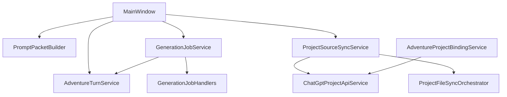

# Services Reference

Catalog of business-logic services in `ChatGPTWrapper/Adventure/Services/` and `ChatGPTWrapper/ChatGptApi/`. Stores (`AdventureStore`, `LibraryStore`, `BackupService`) are documented in [Data Model Reference](data-model-reference.md).

---

## Generation job matrix

| Job ID | Purpose | Delivery | Review target | Handler |
|--------|---------|----------|---------------|---------|
| `extract_entities` | Extract characters/locations/quests from transcript | Separate or inline | `entities.reviewQueue` | `GenerationJobHandlers` |
| `expand_entity` | Expand one entity entry | Separate or inline | `entities.reviewQueue` | `GenerationJobHandlers` |
| `propose_memories` | Suggest memory entries | Separate or inline | `memory.reviewQueue` | `GenerationJobHandlers` |
| `update_summary` | Propose rolling summary | Separate or inline | `summary.pendingReview` | `GenerationJobHandlers` |
| `bootstrap_lore` | Initial story cards / lore | Separate or inline | `cards.reviewQueue` | `GenerationJobHandlers` |
| `expand_story_card` | Expand one card | Separate or inline | `cards.reviewQueue` | `GenerationJobHandlers` |
| `continuity_check` | Local continuity warnings | Separate or inline | `continuity.warnings` | `GenerationJobHandlers` |
| `propose_source_edits` | Propose markdown edits | Separate or inline | `scenario.sourceEditReviewQueue` | `GenerationJobHandlers` |
| `propose_json_import` | Propose JSON from sources (AI fallback) | Utility thread | `scenario.jsonImportReviewQueue` | `GenerationJobHandlers` |
| `process_turn` | Legacy bundled processing | — | Multiple | Obsolete |
| `generate_recap` | — | — | — | Obsolete (local `RecapFormatter`) |

**Orchestrator:** `GenerationJobService.RunJobAsync`  
**Scheduler:** `GenerationJobScheduler` — auto-queue after accepted turns  
**Shell entry:** `MainWindow.RunGenerationJobForActiveAdventureAsync` (gated by `_generationJobGate`)

**Instruction bodies:** `GenerationJobGuideService.ResolveInstructionBody` (built-in + per-adventure overrides)

**Utility threads:** `GenerationUtilitySessionService` — create/rotate/reconcile per job id

---

## Turn and play

### AdventureTurnService

**File:** `Adventure/Services/AdventureTurnService.cs`  
**Role:** DOM-level play automation via adventure bridge.

| Method | Description |
|--------|-------------|
| `SendPromptAsync` | Full send + capture flow |
| `SubmitPromptAsync` | Submit with display line masking |
| `SendTurnAsync` | High-level turn send |
| `CaptureAssistantAsync` | Capture stable assistant text |
| `CaptureThreadTranscriptAsync` | Thread transcript pairs |
| `GetAssistantTurnCountAsync` | Assistant turn count |
| `StartProjectChatAsync` | Start project-scoped chat |
| `SubmitUtilityJobAsync` | Send utility job on utility thread |
| `SubmitInlineUtilityJobAsync` | Inline utility on play thread |

**Result types:** `AdventureTurnResult`, `CaptureAssistantResult`, `ComposerFillResult`, `ThreadTranscriptCaptureResult`

**Called by:** `MainWindow.PlayInjection`, `GenerationJobService`, `AdventurePlayView`

### PromptPacketBuilder

**Role:** Build fat/thin play prompt packets from bundle state.

| Output | Description |
|--------|-------------|
| `PromptPacketResult` | Final packet text + metadata |
| `PromptPacketContextResult` | Context viewer sections |

**Uses:** `ProjectSourceInjectionService`, `ContextPointerResolver`, `InstructionSourcesPolicy`, `ContextTagFormat`

When `UseSectionInjection` is true, builds `[[cgw:sources v="2"]]` via `ContextPointerRenderer` instead of story-card triggers and entity excerpts.

**Called by:** Play injection, `ContextViewerDialog`, bootstrap

### PromptInjectionService

Prepares injection dialog state, preview packets, trim strategy.

### AdventurePlayContextService

Ensures play context: conversation URL, composer state, project binding.

**Uses:** `PlayContextSessionCache` (5-minute in-memory cache)

### PlayThreadTranscriptService

Captures and formats play-thread transcript for story context and utility jobs.

### TranscriptFilterService

`ApplyLookbackAndFilter` — transcript lookback, utility-pair filtering, context stripping.

### AdventureBootstrapService

"Start adventure" first-turn bootstrap packet and narrator open.

### AdventureSessionService

Play session start/end, `CurrentSessionId` management.

### TurnTimelineService

Accept/reject turns, branch, remove pending, timeline mutations.

### PlayTabPinService

Resolve/create pinned play and utility WebView tabs.

### DebouncedAdventureSaver

300ms debounced `AdventureStore.Save` after bundle mutations. Saves the live in-memory `AdventureBundle` supplied by the host dialog (not a reload from disk).

---

## Generation jobs (utility pipeline)

> **Full pipeline doc:** [utility-job-orchestration.md](utility-job-orchestration.md) — readiness gate, atomic DOM turns, session reuse, error codes.

### GenerationJobService

**Role:** Run utility AI jobs end-to-end.

- `EnsureUtilityConversationAsync` — create/reuse/reconcile per-job threads (no spurious rotation when missing from sidebar)
- `UtilityConversationReadinessService.ProbeAsync` — Registered / DomOnly / Unready
- **Registered** → `ChatGptConversationSendService.SendUserMessageAsync`
- **DomOnly** → `AdventureTurnService.SubmitUtilityJobAsync` (atomic `sendPrompt` → `turnComplete`)
- **Inline** → `SendInlineUtilityPacketDomAsync` on play WebView
- Build job packet via `GenerationJobHandlers` + `UtilityStoryContextBuilder`
- Parse JSON response (null-safe), enqueue review items
- Trace `utility_job_phase` events to `play-send-trace.jsonl`
- Returns `GenerationJobResult`

### Adventure design suite

**Files:** `Adventure/Services/AdventureDesignService.cs`, `AdventureDesignChatService.cs`, `AdventureDesignExtractionService.cs`, `AdventureDesignFinalizeService.cs`, `AdventureDesignContextService.cs`, `DesignTabPinService.cs`  
**UI:** `Views/AdventureDesignWizard.xaml` (Setup only), `Views/AdventureDesignView.xaml` (Concept–Review)  
**Shell:** `MainWindow.AdventureDesign.cs`, `MainWindow.DesignTab.cs`

Hybrid flow:

1. **Setup wizard** (modal) — title/genre, link Project, **Continue to Design** (no inline chat).
2. **Design app mode** (`AppMode.Design`) — draft panel + manually pinned `[CGW:design]` project thread in the browser tab.
3. **Launch** — finalize scenario/sources; optional lore bootstrap and separate play thread.

| Component | Role |
|-----------|------|
| `AdventureDesignService` | Step navigation, per-step drafts, proposal merge |
| `AdventureDesignChatService` | Step brief packets for `design_adventure` (`ResolveOutgoingMessage`); per-file source prompts via `AdventureDesignSourcePromptService` |
| `AdventureDesignSourcePromptService` | Tailored prompts for each canonical Project source file (`scenario.md`, `world.md`, `plot.md`, `cast.md`, `instructions-snippet.md`) |
| `AdventureDesignExtractionService` | Parse `design_extract_step` JSON into field proposals |
| `AdventureDesignFinalizeService` | Write `scenario.json`, seed entities, export `sources/`, set Active |
| `AdventureDesignContextService` | `PrepareDesignBrowserAsync` (open Project page), `EnsureDesignThreadAsync` (use pinned/reconciled `UtilitySessions["design_adventure"]` — no auto-create) |
| `DesignTabPinService` | `PinnedDesignTab*` pin/restore; **Use this tab as design thread** after user creates a Project chat |
| `DesignThreadRotationService` | **Start new design thread…** — release stale `design_adventure` session + pin; navigate to Project (CMD-85, mirrors play rotation) |

**Design thread setup:** Continue to Design opens the linked **Project page** (not an auto-created chat). Create a **New chat** in ChatGPT, then click **Use this tab as design thread**. Send step brief / Extract require a pinned design thread.

**Stale design thread:** Design panel → **Start new design thread…** releases `UtilitySessions[design_adventure]` and `PinnedDesignTab*`, copies a **start packet** (utility seed + current step brief) to the clipboard, and navigates to the Project page — then New chat → paste (Ctrl+V) → Send → pin (same pattern as **Start new play thread…**).

**Source file prompts:** On each design step (and all files on **Sources** / **Review**), use **Draft …md** buttons to send structured prompts that ask the model to produce canonical markdown matching `SectionSchema` / `ProjectSourceFileTemplates`.

**Jobs:** `design_adventure` (step brief), `design_extract_step` (structured extract), `draft_framework` — routed to the pinned design WebView when `AppMode.Design`; `GenerationJobContext.DesignStep` carries the active wizard step.

**Entry:** Dashboard **Design with AI…** → Setup wizard → Design mode. **Continue design** opens Design mode directly when `CurrentStep > Setup`.

### GenerationJobHandlers

Static handlers per `GenerationJobId`: `BuildSeedPrompt`, `BuildJobPacket`, parse responses.

### InlineUtilityPipeline

DOM-only inline utility delivery on play thread when `UtilityDeliveryMode.Inline`.

### UtilityDeliveryModeService

Resolves effective delivery mode from settings.

### UtilityConversationReadinessService

**Role:** Pre-send readiness gate for utility jobs.

`ProbeAsync` returns `UtilityConversationReadinessLevel`:

- **Registered** — API `GET /conversation/{id}` succeeds → API send path
- **DomOnly** — API 404/429 but composer healthy → atomic DOM send
- **Unready** — nav/bridge/composer failure → fail fast

Includes rate-limit backoff (15s after 429) and pin-tab hint for DomOnly without utility pin.

### UtilityConversationPageService

Utility conversation URL matching and page verification.

### UtilityStoryContextBuilder

Builds story context block for utility job packets from transcript/settings.

**Uses:** `UtilityStoryContextProfiles`, `UtilityTranscriptScopeService`

### UtilityStoryContextSettingsService / Normalizer

Per-adventure utility context settings defaults and role mapping.

### EntityExtractionService

Entity JSON normalization and extraction helpers (used by handlers).

### EntityTypeNormalizer

Normalizes entity type strings from AI output.

---

## Project sync and sources

### AdventureProjectBindingService

Link/unlink projects, `EnsureSessionAsync`, returns `ProjectBindingResult`.

### ProjectSourceSyncService

**Public API** for apply sync plan, pull/push files. Returns `ProjectSourceSyncResult`.

### ProjectFileSyncOrchestrator

Coordinates full sync run: plan → preflight → apply → manifest update.

### ProjectFileSyncPlanner

Builds `SourceSyncPlan` from local manifest + remote file list.

### ProjectSourceExportService

Export bundle state to canonical `sources/*.md` files.

### SectionedExportService

Sectioned canon export (`scenario.md`, `world.md`, `plot.md`, `cast.md`), manifest `sections[]` with `bodyCache`, and `context-index.json` persistence.

### ProjectSourceImportService / SectionedImportService

Deterministic, offline import — semantic inverse of export. Parses canonical `sources/*.md` into `scenario.json`, `entities.json`, and manifest `sections[]` / hashes.

| Method | Use |
|--------|-----|
| `ProjectSourceImportService.Import` | Full import from disk; optional `DryRun` preview (rolls back in memory) |
| `RefreshManifestSectionsFromMarkdown` | Parse one file after design write — updates manifest sections for pointer resolution |
| `SectionedImportService.Import*` | Per-file parsers (`scenario`, `world`, `plot`, `cast`, `lexicon`) |

**UI:** Design → local sources panel → **Regenerate JSON from sources** (dry-run confirm, then save + reload).

**Merge rules:** stable entity IDs via manifest `sourceEntityId`; new `###` entries add entities; missing entities queue `SourceEditReviewQueue`; lexicon `in-use` section ignored.

### ContextPointerResolver

Scores signals (pinned, location, names, oblique triggers), deduplicates, applies budget, and produces baseline / this-turn / inline pointers for packet v2.

### StoryCardMigrationService / SectionInjectionMigrationService

Migrates enabled story cards into entities, aliases, and `context-index.json`; enables `UseSectionInjection` on load when legacy cards remain.

### SectionDiffService

Compares section body hashes vs last manual publish for Source Manager republish hints.

### ProjectSourceInjectionService

Fat vs thin packet readiness: `ProjectSourceReadiness`; thin mode gates on four core lore files.

### ProjectSourceProbeService

Remote hash probing without full download.

### SourceManifestHelper

Manifest migrations, `RefreshSyncedFlag`, entry helpers.

### SourceEditService

Apply reviewed source edit proposals to local files.

### SourceFileHistoryService

Version archive/restore/prune for source files.

### InstructionContractService

Structured narrator contract: global boundaries, character portrayal rules, addendum. Builds contract sections for instructions and packets; hydrates Design → Instructions fields; parses `instructions-snippet.md` on import. See [instruction-contract-guide.md](instruction-contract-guide.md).

### InstructionSourcesPolicy

Static rules for instructions vs sources vs packet delegation.

### TextDiffService

Line diff and unified diff for source compare UI.

### ProjectRemoteListCache / ProjectSidebarCache

Short-lived caches for remote project/file lists.

---

## Review, export, search

### PendingReviewService

Aggregate review queue counts across entities, memory, cards, scenario edits.

### ExportService

Export adventure to Markdown, HTML, JSON, zip.

### SearchService

Full-text search across adventure documents. Returns `SearchHit[]`.

### RecapService / RecapFormatter

Local digest recap formatting (no AI for `generate_recap`).

### ContinuityService

Build `ContinuityWarning` list for continuity check job and UI.

---

## ChatGPT API services

### ChatGptProjectApiService

**Role:** All Projects/files API operations via API bridge.

| Method group | Examples |
|--------------|----------|
| Session | `GetSessionAsync`, `PrepareForApiAsync` |
| Projects | `ListProjectsAsync`, `UpsertProjectAsync`, `GetGizmoDetailAsync` |
| Conversations | `CreateProjectConversationDetailedAsync`, `ListProjectConversationsAsync` |
| Files | `GetProjectFilesAsync`, `UploadProjectFileAsync`, `DownloadFileAsync`, `DeleteProjectFileAsync` |
| Attach | `AttachProjectFilesViaUpsertAsync`, `DetachProjectFilesViaUpsertAsync` |
| Sync | `ValidateSyncPreflightAsync`, `ReplaceProjectFileAsync` |
| Discovery | `ProbeSidebarAsync`, `ListProjectsFromBootstrapAsync`, `ListProjectsFromDomAsync` |

### ChatGptConversationSendService

Conversation send via `/backend-api/f/conversation` with parent/conduit caching.

| Method | Purpose |
|--------|---------|
| `PrefetchParentAsync` | Cache parent message id |
| `PrefetchConduitAsync` | Cache conduit JWT |
| `PingAsync` | Bridge health |
| Send methods | Build body, stream parse, return `ConversationSendResult` |

### ChatGptSessionHost

In-process orchestrator implementing `IChatGptSessionHost` — coordinates project host, API service, turn service.

### ChatGptProjectHost

API bridge readiness, `ProjectSessionStatus` checklist.

### ProjectDiscoveryService

Merged project discovery (sidebar + bootstrap + DOM). Writes `project-discovery-trace.jsonl`.

### PlaySendWarmupService

Fire-and-forget prefetch of parent/conduit before play send.

### PlayConversationIdResolver

Resolve conversation id from URL/DOM/metadata.

### ConversationParentCache / ConversationConduitCache

In-memory send prerequisite caches.

### ChatGptApiDiscovery / ChatGptApiClientProfile

API capability probing and client profile persistence.

### ProjectLinkDiagnostics / ProjectSyncTrace / ProjectUpsertAudit

Logging and trace infrastructure for link/sync operations.

### ChatGptApiSendSampleCapture

Sanitized send sample capture for tests.

### GizmoResponseParser / BridgeScriptJson

JSON parsing helpers for bridge responses.

---

## Metadata and context

### AdventureMetadataMigration

On-load migrations — see [Data Model — Migrations](data-model-reference.md#migrations).

### ContextTagFormat

Formats `[[cgw:section]]` context tags in packets.

### StateTableHelper

Renders state tables for packets and UI.

---

## Stores (persistence layer)

| Store | File | Role |
|-------|------|------|
| `AdventureStore` | `Adventure/Stores/AdventureStore.cs` | Load/save `AdventureBundle` |
| `LibraryStore` | `Adventure/Stores/LibraryStore.cs` | Reusable libraries |
| `BackupService` | `Adventure/Stores/BackupService.cs` | Zip backup/restore |

---

## Call graph (simplified)

---

## Related documentation

- [Architecture](architecture.md)
- [ChatGPT API Integration](chatgpt-api-integration.md)
- [WebView Bridges](webview-bridges.md)
- [Adventure Panel §13](adventure-panel.md#13-services-and-code-map)
- [Instruction vs Sources Paradigm](instruction-sources-paradigm.md)
