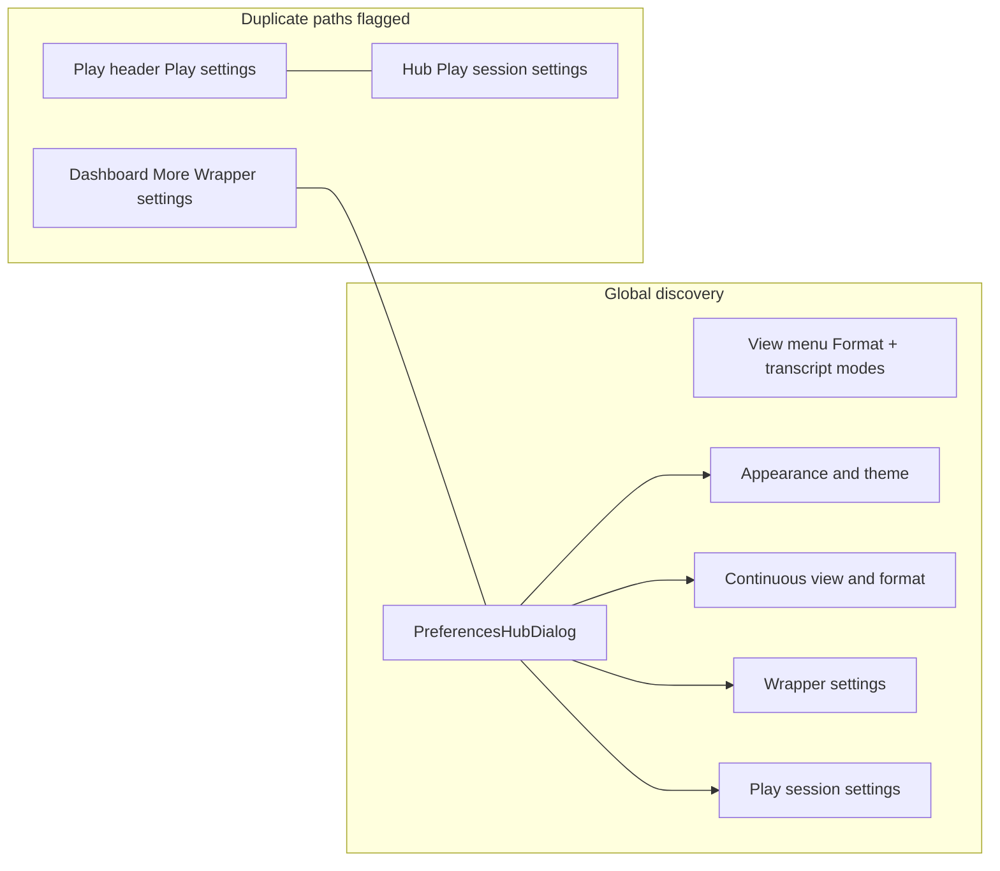

# Settings & Interactables Audit Findings

Surface-by-surface audit for [CMD-256](https://linear.app/cmd0112/issue/CMD-256) through [CMD-261](https://linear.app/cmd0112/issue/CMD-261). Each row: **control → recommendation** (keep | move | merge | hide | deprecate) + rationale.

**Parent:** [CMD-254](https://linear.app/cmd0112/issue/CMD-254) · **Inventory:** [settings-interactables-inventory.md](settings-interactables-inventory.md) · **Taxonomy:** [settings-ux-taxonomy.md](settings-ux-taxonomy.md)

---

## CMD-256 — Global shell & discovery

| Control / path | Recommendation | Rationale |
|----------------|----------------|-----------|
| View → Format… | **keep** | Primary format entry; toolbar Format button removed |
| View → transcript modes (Native / Continuous / Weave) | **keep** | Mode switch belongs in View menu |
| ⋯ → Preferences… hub | **keep** | Canonical global discovery surface |
| Preferences → Wrapper settings | **keep** | Single wrapper path via hub |
| Dashboard More → Wrapper settings | **merge** | Route to Preferences hub (CMD-263) |
| Dashboard footer → Storage settings | **merge** | Same as wrapper settings; use hub |
| Play header → Play settings | **keep** | Contextual primary for active adventure |
| Preferences → Play session settings | **keep** | Hub shortcut when adventure loaded |
| Status bar → bridge / link | **keep** | Contextual diagnostics entry |
| `LegacyContinuousViewEnabled` | **deprecate** | Migration-only; no UI |
| Toolbar Format button (if present in old docs) | **deprecate** | Removed; View menu only |

---

## CMD-257 — Play mode & in-session

| Control | Recommendation | Rationale |
|---------|----------------|-----------|
| Play settings tabs (Next send, World, AI Actions, Session, Play surface, Settings, Memory, Sources, History) | **keep** | Core play IA; regroup under CMD-264 |
| Session cockpit narrator overrides | **keep** | Send-scoped; belongs in-session |
| Narrator Advanced… dialog | **merge** | Fold into Next send or Session tab (CMD-264) |
| Play surface layout presets | **keep** | High-value contextual layout |
| Force fat packets | **keep** | Move to Advanced automation tier (CMD-264) |
| Prefer DOM composer send | **keep** | Developer tier; hide behind expander |
| Use wrapper composer | **deprecate** | UI removed; schema retained |
| Auto-extract / memory / summary / continuity | **keep** | Settings tab; group as Automation |
| Sources tab sync shortcuts | **merge** | Primary path = SourceManagerDialog |
| Draft framework from Play More | **merge** | Prefer Design mode entry |
| AI tools (Process, Memories, Recap) | **keep** | Session cockpit actions |
| Side panel tab placement | **keep** | Play surface tab |

---

## CMD-258 — Design mode

| Control | Recommendation | Rationale |
|---------|----------------|-----------|
| Design wizard steps | **keep** | Authoring flow |
| Pipeline checklist | **keep** | Progress visibility |
| Instruction designer | **keep** | Shared with Play sources |
| JSON import review | **keep** | Design-only import |
| Cast / entity reference panel | **keep** | Entity CRUD |
| Draft framework job | **merge** | Single entry from Design pipeline |
| Play/Design toggle (CMD-21) | **keep** | In-session surface switch |

---

## CMD-259 — Adventure management (dashboard)

| Control | Recommendation | Rationale |
|---------|----------------|-----------|
| New / Play / Rename / Delete / Archive | **keep** | Core library ops |
| Link Project | **keep** | Opens ProjectWorkspaceDialog |
| Libraries | **keep** | Global libraries store |
| Import backup / folder | **keep** | Data portability |
| Design with AI / Continue design | **keep** | Onboarding paths |
| Wrapper / Storage settings | **merge** | → Preferences hub |
| Draft framework (More) | **merge** | → Design mode |
| Search / sort / archived filter | **keep** | Library UX |

---

## CMD-260 — Projects & sources

| Control | Recommendation | Rationale |
|---------|----------------|-----------|
| ProjectWorkspaceDialog | **keep** | Replaces ProjectLinkWizard |
| SourceManagerDialog | **keep** | Primary sources surface |
| Source sync / compare | **keep** | Sub-dialogs of manager |
| Instruction designer | **keep** | Shared component |
| SourcePublishMode Manual | **keep** | Only supported mode |
| SourcePublishMode ApiSync | **deprecate** | Forced Manual on load/save |
| Auto-sync project instructions | **keep** | Settings tab |
| Sync from thread | **keep** | Drift recovery |
| Published checkboxes (Play settings Sources) | **merge** | Prefer SourceManager as primary |

---

## CMD-261 — Entity, utility & misc dialogs

| Control | Recommendation | Rationale |
|---------|----------------|-----------|
| Entity edit / merge / retire / rename wizard | **keep** | Reference CRUD |
| PlayHandoffDialog | **keep** | Session handoff |
| Recap / Search / Random table / Canon inbox | **keep** | More actions |
| ContextViewerDialog | **keep** | Packet debug |
| PhraseHighlightsDialog (standalone) | **deprecate** | Embedded in Format dialog |
| AdventureSettingsDialog | **deprecate** | Zero callers; delete files |
| ProjectLinkWizard | **deprecate** | Superseded by ProjectWorkspaceDialog |
| ResponseReviewDialog | **deprecate** | No production entry |
| EditTurnDialog | **deprecate** | Legacy story log |
| UtilityDeliveryMode SeparateThread | **deprecate** | Migrated inline |
| Hide / show inline utility traffic | **keep** | Session tab peek toggles |

---

## Consolidated deprecate register (UI removal, schema kept)

| Item | Action this wave |
|------|------------------|
| `UseWrapperComposer` checkbox | Remove from PlayPromptInjectionDialog |
| `PhraseHighlightsDialog` | Delete files |
| `AdventureSettingsDialog` | Delete files |
| `ProjectLinkWizard` | Delete files |
| Dashboard wrapper/storage settings | Open Preferences hub |
| `LegacyContinuousViewEnabled` | Document only |
| `ApiSync`, `SeparateThread` | Document only (already migrated) |

**Deferred to CMD-264:** Full Preferences hub v2 IA, play settings tab regrouping, narrator Advanced merge.

**Done in W3 (CMD-263):** Advanced automation expander (Force fat packets, Prefer DOM send) in Play settings → Settings tab.

---

## Sign-off

Audits complete for W0–W2. Implementation of merge/deprecate items tracked on [CMD-263](https://linear.app/cmd0112/issue/CMD-263) (partial) and [CMD-264](https://linear.app/cmd0112/issue/CMD-264) (hub v2).
