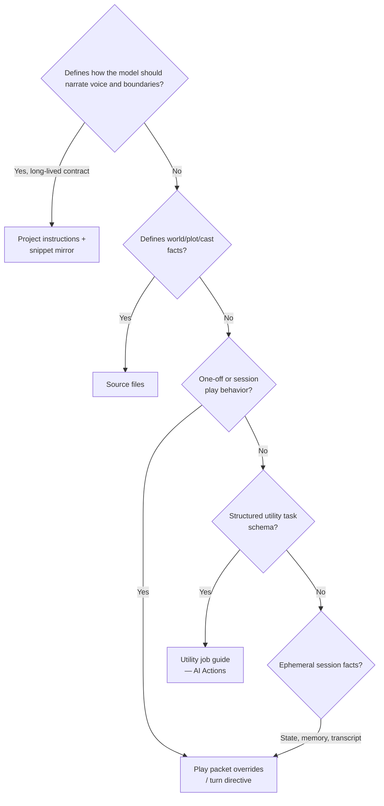

# Instruction Channels — Glossary & Decision Tree

**Issue:** [CMD-289](https://linear.app/cmd0112/issue/CMD-289) · **Epic:** [CMD-292](https://linear.app/cmd0112/issue/CMD-292)

Canonical terminology for the five instruction-bearing surfaces in ChatGPT Wrapper. Use these names in UI copy, docs, and code comments to avoid “instructions” meaning four different things.

**Read order:** [instruction-sources-paradigm.md](instruction-sources-paradigm.md) (theory) → **this doc** (glossary + routing) → [instruction-contract-guide.md](instruction-contract-guide.md) (authoring) → [injection-policy-adr.md](../adr/injection-policy-adr.md) (assembly rules) → [narrator-settings.md](narrator-settings.md) (runtime overrides)

---

## Glossary

| Channel | UI label | Change rate | What it is | What it is **not** |
|---------|----------|-------------|------------|-------------------|
| **Project instructions** | Project instructions | Rare — paste into ChatGPT Project custom instructions | Narrator *contract*: perspective, tense, tone, boundaries, portrayal, addendum, author's note | World lore, plot, cast, session state, turn tweaks |
| **Source files** | Source files / canon | Often — after design edits and review | Canonical world material (`scenario.md`, `world.md`, `plot.md`, `cast.md`, …) for Project RAG | Narrator contract, ephemeral play state |
| **Instruction snippet** | `instructions-snippet.md` | Mirrors Project instructions | RAG mirror of the contract — same body as Copy instructions | A second contract authors edit independently |
| **Play packet** | Packet / injection | Every send | Deltas only: state, memory, transcript tail, pointers, turn/session overrides, attachment manifest | Full contract or lore when thin/delegated path applies |
| **Utility job guides** | Job guide (AI Actions) | Per job, optional per-adventure override | Inline `=== JOB GUIDE ===` for extraction, summary, continuity, etc. | Narrator voice, world canon, play overrides |

### Aliases to avoid in new copy

| Avoid | Use instead |
|-------|-------------|
| “Instructions” (alone) | Name the channel: Project instructions, job guide, packet overrides |
| “Narrator instructions” for world rules | Source files or lore cards |
| “Context instructions” | Play packet or source pointers |
| “Settings” for contract edits | Project instructions contract (adventure baseline) |

---

## Decision tree

**Quick rules:**

1. **How to narrate** → Project instructions (designer → Copy → paste → Mark pasted).
2. **What the world is** → Source files (export → upload → Mark published).
3. **This send / this session tone** → Play cockpit **Injection** or Play settings → **Next send** (packet only).
4. **Extract entities / summarize / continuity** → Play settings → **AI Actions** (job guide channel).
5. **What just happened** → Local log/state — optional export to sources after review.

---

## Producer audit (code)

| Producer | Channel | Synced to Project? | Notes |
|----------|---------|-------------------|-------|
| `InstructionSourcesPolicy.BuildStaticInstructionsBody` | Project instructions | Yes (manual paste or API) | Excludes world rules, plot, cast |
| `InstructionContractService.BuildInstructionsSnippetFileContent` | Snippet mirror | Uploaded as source file | Same body as static instructions |
| `InstructionContractService.BuildInstructionDomainCanonical` | Project instructions hash | Hash only — drift detection | **Excludes** `PlayTurnOverrides`, `SessionNarratorOverrides`, utility overrides |
| `ProjectSourceExportService` | Source files | File upload | Never includes packet overrides |
| `NarratorOverrideResolver` | Play packet | **Never** | Appends `=== TURN OVERRIDES ===` etc. only when ≠ baseline |
| `PromptPacketBuilder` / `PromptInjectionService` | Play packet | **Never** | Thin path omits contract reachable via Project |
| `GenerationJobGuideService` | Utility job guides | **Never** | Inlined in job packets only |
| `InstructionRefinementPromptService` | Design AI polish | **Never** | Wording assist — output flows to designer, not live packet |

### Override isolation (verified)

`BuildInstructionDomainCanonical` hashes only adventure baseline fields (`Perspective`, `Tense`, `Tone`, boundaries, portrayal, addendum, author's note). It does **not** read:

- `AdventureSettings.PlayTurnOverrides`
- `AdventureSettings.SessionNarratorOverrides`
- `AdventureSettings.UtilityJobOverrides`
- Per-job instruction overrides in `GenerationJobGuideService`

Packet overrides are applied at send time via `NarratorOverrideResolver.AppendOverrideBlocks` after `PromptPacketBuilder` assembly.

---

## UI surface map

| Surface | Channel(s) shown | File |
|---------|------------------|------|
| Instructions designer | Project instructions contract | `InstructionDesignerDialog.xaml` |
| Source Manager | Project instructions + source files | `SourceManagerDialog.xaml` |
| Play settings → Sources | Same + publish grid | `PlayPromptInjectionDialog.xaml` |
| Play settings → Next send | Play packet + turn overrides | `PlayPromptInjectionDialog.xaml` |
| Play settings → AI Actions | Utility job guides | `PlayPromptInjectionDialog.xaml` |
| Play cockpit → Injection | Packet overrides + live preview | `AdventurePlayView.xaml` |

Drift banners (`InstructionDriftLine`, `InstructionsPastedLine`) compare **Project instructions** hash only — not packet or job channels.

---

## Related follow-ups (not CMD-289 scope)

| Issue | Topic |
|-------|-------|
| [CMD-94](https://linear.app/cmd0112/issue/CMD-94) | Refine-instructions canonical body sync |
| [CMD-22](https://linear.app/cmd0112/issue/CMD-22) | OOC instruction canonization |
| [CMD-24](https://linear.app/cmd0112/issue/CMD-24) | Instructions designer UX polish |
