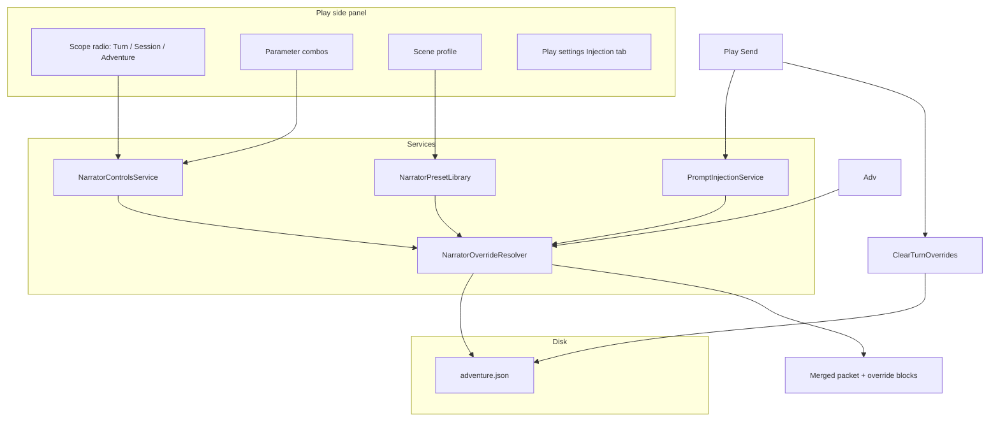

# Narrator Settings — Play Side Panel

How narrator controls in the adventure **play side panel** work today: UI surfaces, three override scopes, packet injection, and persistence.

**Related:** [Adventure Panel Reference](adventure-panel.md) · [Instruction Channels Glossary](instruction-channels.md) · [Instruction Contract Guide](instruction-contract-guide.md) · [Prompt Construction Guide](prompt-construction-guide.md) · [Data Model Reference](../reference/data-model-reference.md)

---

## Overview

Narrator settings let you modulate **how the model narrates the next response** without editing the full instruction contract. They are separate from:

| Layer | What it controls | Where to edit |
|-------|------------------|---------------|
| **Instruction contract** | Perspective, tense, boundaries, portrayal rules, author's note | Play settings → **Settings**, Design → Instructions |
| **Adventure defaults** | Baseline detail, tone, pacing, combat difficulty, violence, consequence weight (`AdventureSettings`) | Play settings → **Behavior**, Design → Instructions |
| **Narrator overrides** | Temporary shifts to all narrator scale dimensions plus directives | Play side panel **Injection** expander and Play settings → **Injection** tab |

Overrides do **not** replace the instruction contract. They append optional blocks to the merged play packet at send time (`NarratorOverrideResolver.AppendOverrideBlocks`), layered on top of whatever `PromptPacketBuilder` already assembled.

**Injection policy** (section includes, presets, transcript depth) lives in `AdventureSettings.injectionPolicy` and is edited on Play settings → **Injection** tab or via quick toggles in the cockpit. See [Prompt Construction Guide — Play injection policy](prompt-construction-guide.md#play-injection-policy).

---

## Scale definitions (`narrator-scales.md`)

Preset selectors like `Combat difficulty: balanced` or `Tone: grim` are meaningless to the model without definitions. The wrapper auto-generates **`sources/narrator-scales.md`** on adventure create and export — a cross-adventure reference file (like `canon-format.md`) with two categories:

| Category | Dimensions | Play UI | Contract baseline |
|----------|------------|---------|-------------------|
| **Narration (delivery)** | Response length, Detail level, Tone, Narrative pacing | Injection panel + Play settings → Injection — overridable per send/session/adventure | Instructions designer |
| **Combat & stakes** | Combat difficulty, Violence level, Consequence weight | Same — all overridable per send/session/adventure | Instructions designer |

| File | Role |
|------|------|
| `instructions-snippet.md` | **Which** scales are active (adventure baseline selectors) |
| `narrator-scales.md` | **What each selector means** — model must **inspect and read** full preset sections |
| Turn/session overrides | Change selectors only; packets point to `narrator-scales.md` § dimension/preset |

**Model instruction:** Packets and `instructions-snippet.md` tell the model to **open and read** `narrator-scales.md` from Project Files and apply the **Summary**, **Narration behavior**, and **Avoid** bullets for each active selector — not to guess from labels alone.

**Upload:** Source Manager → Refresh export → upload `narrator-scales.md` with `canon-format.md` and lore → mark **Published**.

**Play packets:** Fat fallback includes categorized active-scale summaries; turn overrides expand to `Combat difficulty: hard — … (inspect narrator-scales.md § combat-difficulty/hard)`.

Combo tooltips in the Injection panel show preset summaries from the same catalog.

---

## Where to find controls

### Session cockpit — Injection expander

**File:** `ChatGPTWrapper/Views/AdventurePlayView.xaml`

In Play mode, the left (or right, per layout) companion panel includes a **Session** cockpit with an **Injection** expander (formerly “Narrator”). This is the **live injection control surface** (CMD-296):

| Area | Purpose |
|------|---------|
| **Live preview** | `InjectionPacketPreviewControl` — delegation badge, char budget bar, section list (Reference / Delta / Omitted / Trimmed), delta callouts, packet body |
| **Quick policy** | Preset combo (Compact / Standard / Full), Summary / Transcript / Memory toggles |
| **Narrator behavior** | Scene profiles, scope selector; **Narration** (length/detail/tone/pacing) and **Combat & stakes** (difficulty/violence/consequences) |
| **Play settings…** | Opens Play settings → **Injection** tab (full editor + staging preview; synced with cockpit) |

Preview refreshes when narrator or injection policy controls change, or when the expander opens. **Play settings** uses a split-pane layout: tabs on the left, shared live preview on the right (`InjectionPreviewCoordinator` + `PrepareSend` staging).

**Adventure default** scope shows a warning: baseline edits are contract changes — use Play settings → Settings for boundaries and portrayal rules.

| Control | Purpose |
|---------|---------|
| **Scene profile** | One-shot preset applying coordinated values to the active scope |
| **Active override chips** | Summary of turn + session overrides currently set |
| **Apply changes to** | Scope selector: **This send**, **Session**, or **Adventure default** |
| **Narration** | Length, Detail, Tone, Pacing — delivery overrides |
| **Combat & stakes** | Combat difficulty, Violence, Consequence weight — all editable with scope |
| **Reset scope** | Clears overrides for the selected scope only |
| **Full narrator settings** | Opens Play settings → **Injection** tab (minimal cockpit mode) |

Changes save immediately to `adventure.json` via `AdventureStore.Save`.

### Narrator cockpit density

Play settings → **Play surface** tab sets global narrator panel density:

| Mode | Companion shows |
|------|-----------------|
| **Minimal** (default) | Scene profile, scope radios, override chips, **Full narrator settings** button |
| **Full** | Minimal controls plus inline combo grid for all seven scale dimensions |
| **Remember last** | Per-adventure last choice stored in `PlayCompanionLastNarratorDensity` |

The legacy `NarratorAdvancedDialog` was removed — turn directive, session addendum, and emphasis toggles live on Play settings → **Injection** tab (`NarratorBehaviorPanel`).

### Play settings — Injection tab

**File:** `ChatGPTWrapper/Views/PlayPromptInjectionDialog.xaml`

The **Injection** tab (first tab) controls `PlayInjectionPolicy`:

| Control | Effect |
|---------|--------|
| **Preset** | Compact / Standard / Full — sets `maxPacketChars`, transcript depth, attachment mode |
| **Section includes** | Summary, state, memory, transcript, lore cards, source pointers, attachment guidance |
| **Max packet slider** | Live budget feedback in preview panel |
| **Advanced formatting** | `useContextTags`, `useSectionInjection` |
| **Narrator behavior** | `NarratorBehaviorPanel` — scene profiles, scope (This send / Session / Adventure default), all seven scale dimensions; synced with cockpit via store reload |

Changes apply to a **staging bundle** for preview before OK; narrator edits on this tab use the selected scope (not turn-only). OK persists to `adventure.json` and reloads the cockpit panel.

### Play settings — Play packet tab

**File:** `ChatGPTWrapper/Views/PlayPromptInjectionDialog.xaml`

The **Play packet** tab focuses on send inputs (not duplicate narrator combos):

- Continuation queue and fallback player line
- Hint linking narrator overrides to the **Injection** tab
- Live merged packet preview (shows override blocks when present)

---

## Three override scopes

| Scope | UI label | Storage | Lifetime |
|-------|----------|---------|----------|
| **Turn** | This send | `metadata.settings.playTurnOverrides` | Cleared after a **successful** play send (`MainWindow.PlayInjection.cs` calls `ClearTurnOverrides`) |
| **Session** | Session | `metadata.settings.sessionNarratorOverrides[sessionId]` | Active play session (`bundle.CurrentSessionId`); removed when session ends (`AdventureSessionService.EndSession`) |
| **Adventure** | Adventure default | `metadata.settings` baseline fields (detail, tone, difficulty, violence, narrativePacing, consequenceWeight) | Until changed again in Play settings or cockpit |

### Resolution order (effective value per send)

For each narrator scale parameter, the effective value is:

```
turn override  →  session override  →  adventure baseline
```

Implemented in `NarratorOverrideResolver.Resolve*` methods for all seven scale dimensions.

**Scope sync:** `metadata.settings.lastNarratorOverrideScope` persists the last selected scope so cockpit and Play settings reopen consistently. Cockpit saves immediately; an open Play settings dialog reloads narrator bindings when the cockpit changes.

**Tone baseline** prefers `settings.Tone`; if empty, falls back to `scenario.Tone` (`ResolveBaselineTone`).

**Response length baseline** is always `"normal"` when nothing is overridden.

### Inherit (`— inherit —`)

Each combo includes an **inherit** option (shown as `— inherit —` or `— inherit — (baseline hint)`). Selecting inherit stores `null` for that parameter at the active scope, so the resolver falls through to the next scope.

Normalization (`NormalizeOverrideValue`):

- Whitespace and the inherit label → `null`
- Response length `"normal"` at turn/session scope → `null` (treated as inherit)
- Narrative pacing / consequence weight `"balanced"` at turn/session scope → `null`

### Adventure scope limitations

When **Adventure default** is selected:

- **Detail, tone, difficulty** — edits write directly to `AdventureSettings` and persist as the adventure baseline.
- **Response length** — there is no adventure-level response-length field. `SetAdventureBaseline` ignores `ResponseLength`; changing length while Adventure scope is selected has **no effect**.
- **Reset scope** — does nothing for Adventure scope (no reset path for baselines from the cockpit).

For permanent baseline changes, use Play settings → **Settings** (Adventure section) or select Adventure scope for detail/tone/difficulty only.

---

## Parameters and presets

Presets live in `NarratorPresetLibrary.cs`. Tone and difficulty combos are **editable** for custom free-text values.

### Response length

| Preset | Packet value |
|--------|--------------|
| Brief | `brief` |
| Short | `short` |
| Normal | `normal` (inherit at override scope) |
| Long | `long` |
| Expansive | `expansive` |

### Detail level

| Preset | Packet value |
|--------|--------------|
| Low | `low` |
| Medium | `medium` |
| High | `high` |
| Cinematic | `cinematic` |

Default adventure baseline: `medium`.

### Tone

| Preset | Packet value |
|--------|--------------|
| Neutral, Dramatic, Whimsical, Grim, Hopeful, Tense, Lyrical | same id |

Custom text is accepted via editable combo.

### Combat difficulty

Combat & stakes category — how hard challenges are and how punishing failures are (not the same as narration tone or detail).

| Preset | Packet value |
|--------|--------------|
| Easy, Balanced, Moderate, Hard, Brutal | same id |

Default adventure baseline: `balanced`. Override per send/session in Injection panel; definitions in `narrator-scales.md` § `combat-difficulty`.

### Violence level

Combat & stakes category — how graphic violence may be depicted. Overridable per send/session; adventure baseline in Instructions designer.

| Preset | Packet value |
|--------|--------------|
| None, Mild, Moderate, Intense | same id |

Default: `moderate`. Definitions in `narrator-scales.md` § `violence-level`.

### Narrative pacing

Narration category — beat tempo and scene transitions (distinct from response length).

| Preset | Packet value |
|--------|--------------|
| Deliberate, Balanced, Brisk | same id |

Default: `balanced`. Definitions in `narrator-scales.md` § `narrative-pacing`.

### Consequence weight

Combat & stakes category — permanence of harm, loss, and failure.

| Preset | Packet value |
|--------|--------------|
| Forgiving, Balanced, Lasting | same id |

Default: `balanced`. Definitions in `narrator-scales.md` § `consequence-weight`.

---

## Scene profiles

Scene profiles apply a coordinated preset to **all parameters defined by the profile** at the **currently selected scope** in the cockpit.

| Profile | Length | Detail | Tone | Pacing | Description |
|---------|--------|--------|------|-------------|
| **Action** | brief | low | tense | brisk | Combat and chase — short, punchy |
| **Exploration** | long | high | lyrical | deliberate | Discovery and travel — rich sensory |
| **Introspection** | normal | medium | hopeful | deliberate | Reflective, inner monologue |
| **Social** | normal | medium | dramatic | Dialogue-forward scenes |
| **Lore** | expansive | cinematic | lyrical | History, myth, exposition |

Profiles do **not** set combat difficulty or violence. After applying a profile, the scene profile combo resets to inherit (index 0) on rebind.

`NarratorPresetLibrary.ApplySceneProfile` calls `SetScopedOverride` for each entry in the profile dictionary.

---

## Packet injection

At send time, `PromptInjectionService.PrepareSend` builds the merged packet, then calls `NarratorOverrideResolver.AppendOverrideBlocks`.

### What gets injected

Only values that **differ from the adventure baseline** appear in the overrides block (except session addendum and emphasis lines, which have their own rules).

Example when turn overrides differ from baseline:

```
=== TURN OVERRIDES ===
Response length: brief
Detail level: high
Tone: grim
Session note: Keep NPC voices distinct this scene.
Emphasize content boundaries for this response.
```

Turn directive is always a separate block when set:

```
=== TURN DIRECTIVE ===
Keep this exchange terse and tactical.
```

### What does *not* change

- **Fat packet narrator line** — `PromptPacketBuilder` still embeds `settings.DetailLevel`, `settings.Tone`, and `settings.Difficulty` from adventure defaults in the main instructions section. Overrides are **additive** appendix blocks, not a rewrite of the fat-packet voice line.
- **Thin / source-delegated packets** — static voice is deferred to Project instructions; override blocks still append when values differ from baseline.
- **Project instructions** — overrides are not pushed to ChatGPT Project custom instructions. They exist only in the play packet for that send (or session, for session-scoped values that persist across sends until cleared).

### After send

On successful turn acceptance:

1. **All turn overrides** are cleared (`PlayTurnOverrideSettings` replaced with empty object), including turn directive and turn-scoped emphasis flags.
2. **Session overrides** remain for the active session.
3. **Adventure baselines** are unchanged.

Preview in Play settings → **Next send** reflects overrides before send; refresh after send to confirm turn overrides cleared.

---

## Persistence

Stored in `adventures/{id}/adventure.json` under `metadata.settings`:

```json
{
  "detailLevel": "medium",
  "tone": "",
  "difficulty": "balanced",
  "playTurnOverrides": {
    "responseLength": "brief",
    "detailLevel": null,
    "tone": "grim",
    "difficulty": null,
    "turnDirective": "Focus on sound and smell.",
    "emphasizeBoundaries": false,
    "emphasizePortrayalRules": false
  },
  "sessionNarratorOverrides": {
    "3fa85f64-5717-4562-b3fc-2c963f66afa6": {
      "responseLength": null,
      "detailLevel": "high",
      "tone": "dramatic",
      "difficulty": null,
      "temporaryAddendum": "This is a horror beat.",
      "emphasizeBoundaries": true,
      "emphasizePortrayalRules": false
    }
  }
}
```

Session keys are `PlaySession.Id` GUID strings. When a session ends, its entry is removed from `sessionNarratorOverrides`.

---

## UI state flow



---

## Active override chips

`NarratorOverrideResolver.GetActiveOverrideChips` drives the chip line under Scene profile:

- Turn-scoped: `length`, `detail`, `tone`, `difficulty`
- Session-scoped: `session length`, `session detail`, etc.
- `directive` when turn directive is set

Shows **"No active overrides."** when empty.

---

## Code map

| Piece | File |
|-------|------|
| Side panel UI | `Views/AdventurePlayView.xaml(.cs)` |
| Full narrator + injection editor | `Views/PlayPromptInjectionDialog.xaml` → **Injection** tab, `NarratorBehaviorPanel` |
| Next-send overrides UI | `Views/PlayPromptInjectionDialog.xaml(.cs)` |
| Combo bind/read/save | `Adventure/Services/NarratorControlsService.cs` |
| Scope resolution + packet blocks | `Adventure/Services/NarratorOverrideResolver.cs` |
| Presets + scene profiles | `Adventure/Services/NarratorPresetLibrary.cs` |
| Send-time merge | `Adventure/Services/PromptInjectionService.cs` |
| Clear turn overrides on accept | `MainWindow.PlayInjection.cs` |
| Session lifecycle | `Adventure/Services/AdventureSessionService.cs` |
| Models | `Adventure/Models/AdventureMetadata.cs` (`PlayTurnOverrideSettings`, `PlaySessionNarratorOverrides`, enums) |
| Unit tests | `tests/ChatGPTWrapper.ApiDiagnostics/Unit/PlayTurnOverrideTests.cs`, `NarratorPresetLibraryTests.cs` |

---

## Common workflows

### Shift tone for one reply

1. Open **Narrator** expander.
2. Ensure **This send** is selected.
3. Set **Tone** to e.g. Grim.
4. Send from the composer.
5. Turn override clears automatically; next send returns to session/adventure baseline unless you set again.

### Run a combat scene for the rest of the session

1. Select **Session** scope.
2. Choose scene profile **Action** (or set length/detail/tone manually).
3. Optionally open **Full narrator settings** (Play settings → Injection) and add a session addendum.
4. Send as normal — session overrides apply to every send until you **Reset scope** (Session) or the play session ends.

### Preview before sending

1. **Play settings…** → **Next send**.
2. Set turn overrides and inspect merged preview.
3. Send — overrides appear in the packet; turn overrides clear after accept.

### Change permanent narrator voice

Use Play settings → **Settings** (detail, tone, difficulty, perspective, boundaries) or cockpit **Adventure default** scope for detail/tone/difficulty. These update `AdventureSettings` and the fat-packet voice line. Consider syncing Project instructions if linked ([Instruction Contract Guide](instruction-contract-guide.md)).

---

## Distinction from utility job overrides

Utility AI jobs (Memories, Summary, Entities, etc.) use a **separate** override system: `UtilityJobOverrides` in Play settings → **AI Actions**. Those affect utility-thread packets only, not play narrator overrides documented here.

---

*Reflects the ChatGPT Wrapper source tree as of the current `ChatGPTWrapper` project.*
