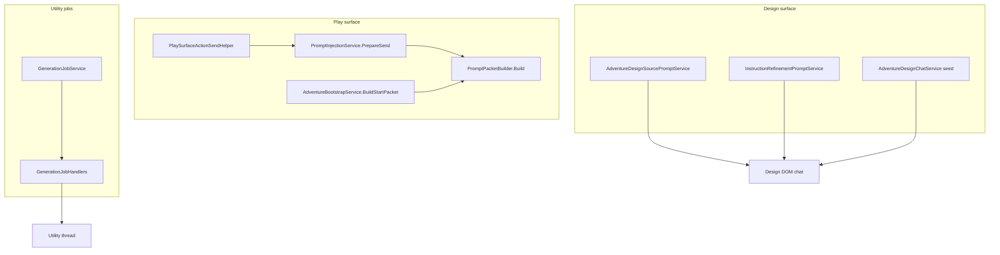
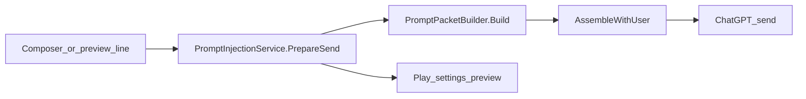

# Prompt Construction Guide

How the wrapper builds text sent to ChatGPT — play packets, bootstrap/start packets, design chat, utility jobs, and one-off synthesis prompts.

**Documentation hub:** [INDEX.md](../INDEX.md)

Related docs: [adventure-panel.md](adventure-panel.md) · [instruction-sources-paradigm.md](instruction-sources-paradigm.md) · [injection-policy-adr.md](../adr/injection-policy-adr.md) · [local-semantic-retrieval-adr.md](../adr/local-semantic-retrieval-adr.md) · [narrative-flight-recorder-adr.md](../adr/narrative-flight-recorder-adr.md) · [user-projects-and-sync.md](user-projects-and-sync.md) · [utility-job-orchestration.md](../developer/utility-job-orchestration.md) · [services-reference.md](../reference/services-reference.md)

---

## Overview

Prompt construction is **not centralized**. Different surfaces use different builders with different goals:

| Category | Primary entry point | Output destination |
|----------|---------------------|-------------------|
| **Play send** | `PromptInjectionService.PrepareSend` | Play thread composer |
| **Start / bootstrap packet** | `AdventureBootstrapService.BuildStartPacket` | Play thread (first turn) |
| **Play surface actions** | `PlaySurfaceActionSendHelper.BuildActionPacket` | Prepended to play send |
| **Design source chat** | `AdventureDesignSourcePromptService.BuildPrompt` | Design tab conversation |
| **Instruction refine** | `InstructionRefinementPromptService.BuildRefinementPrompt` | Design tab conversation |
| **Utility jobs** | `GenerationJobHandlers.BuildSeedPrompt` / `BuildJobPrompt` | Utility thread(s) |
| **Source edit / synthesis** | `SourceEditService`, `SourceSynthesisService` | Utility or inline job |
| **Recap / extraction** | `RecapService`, `EntityExtractionService` | Utility job packets |



---

## Shared play packet pipeline

Most play-related text flows through **`PromptPacketBuilder`**.

### Packet profiles

`PacketProfileResolver.Resolve(bundle, userChoseInlineFallback)` selects **SourceDelegated**, **MinimalLocal**, or **InlineFallback**. See [Injection Policy ADR](../adr/injection-policy-adr.md).

| Profile | When | Context block |
|---------|------|---------------|
| **SourceDelegated** | Linked + all lore published | `[[cgw:meta mode="delegated"]]`, ALWAYS RETRIEVE / THIS TURN pointers |
| **MinimalLocal** | No linked Project | Opening + deltas; `mode="minimal"` |
| **InlineFallback** | `ForceInlineLore` or user proceeds after publish warning | Full contract, cards, lore inline; `mode="inline"` |

### Build steps

1. **`BuildContext`** — assemble the context block per resolved profile.
2. **`AssembleWithUser`** — append the player line (with or without `[[cgw:player]]` wrapper depending on `UseContextTags`).
3. **Trim** — enforce `MaxChars` unless attachment policy skips trim.

`PromptInjectionService.PrepareSend` wraps `Build` and may prepend:

- Attachment guidance (`InjectAttachmentGuidance`)
- Attachment manifest section

Then appends turn/session override blocks and canon-update notice. See [Injection Policy ADR](../adr/injection-policy-adr.md) for assembly order and deduplication rules.

### Assembly order (normative)

Per [injection-policy-adr.md](../adr/injection-policy-adr.md):

1. Resolve delegation (`CanDelegateStaticContent`)
2. Classify sections (reference / delta / conditional-inline)
3. Assemble context at full fidelity
4. Append override blocks (deltas only)
5. Apply budget / trim (`ContextBudgetAllocator`, `MaxPacketChars`)
6. Merge player line

Never trim before deduplication. Start packets with section-injection v2 omit redundant file lists from the player directive when pointers fan out via `freshNarrativeBootstrap`.

### Play injection policy

Authors configure optional packet sections via `AdventureSettings.injectionPolicy` (`PlayInjectionPolicy`):

| Field | Builder effect |
|-------|----------------|
| `includeSummary` | Rolling summary / story-so-far block |
| `includeState` | State delta (mandatory when thin-delegated) |
| `includePinnedMemory` | Pinned memory block |
| `includeTranscript` | Recent transcript tail |
| `transcriptMaxTurns` | `0` → 6 (delegated/minimal) / 12 (inline fallback) defaults |
| `includeTriggeredCards` | Lore cards + trigger pointers |
| `includeSourcesPointers` | `[[cgw:sources]]` block (mandatory when thin-delegated) |

**Presets** (`InjectionPresetLibrary`): `compact` (12k chars, 2 transcript turns), `standard` (28k), `full` (40k, Full attachment mode).

**Preview:** `InjectionPreviewCoordinator` runs `PrepareSend` on a JSON-cloned staging bundle so Play settings and the cockpit preview match send without persisting until OK.

Key files: `PlayInjectionPolicyService.cs`, `InjectionPreviewCoordinator.cs`, `InjectionPacketPreviewControl.xaml`.

### Context pointer resolution (thin mode)

`ContextPointerResolver.Resolve` scores section candidates from signals in the player line, rolling summary, state location, pins, triggers, and attachment tokens.

**Planned (SVA-01):** [local-semantic-retrieval-adr.md](../adr/local-semantic-retrieval-adr.md) adds embedding similarity as a parallel channel fused before budget allocation. New `PointerSource.SemanticMatch`; SourceDelegated profile only; rollout Shadow → On. See [CMD-381](https://linear.app/cmd0112/issue/CMD-381).

| Source | Score | Bucket |
|--------|-------|--------|
| Baseline (`opening`, `rules`, `player`) | 100 | ALWAYS RETRIEVE |
| Pin | 40 | THIS TURN (if ≥ threshold) |
| Name match in player text | 35 | THIS TURN |
| State location (place) | 35 | THIS TURN |
| Trigger in player text | 25 | THIS TURN |
| Attachment token match | 20 | THIS TURN |
| Name match in summary only | 15 | Usually filtered out (threshold 20) |

Pointers with `Source == Baseline` always land in **ALWAYS RETRIEVE**. All other qualifying pointers land in **THIS TURN**.

**Start packet implication:** `BuildStartPacket` uses a source-directed player line listing all core lore files. With `freshNarrativeBootstrap: true`, **ALWAYS RETRIEVE** includes every indexed section in `scenario.md`, `world.md`, `plot.md`, `cast.md`, and `lexicon.md`. Canon-update notify blocks are **not** appended to the start packet.

Key files:

- `ChatGPTWrapper/Adventure/Services/PromptPacketBuilder.cs`
- `ChatGPTWrapper/Adventure/Services/ContextPointerResolver.cs`
- `ChatGPTWrapper/Adventure/Services/ContextPointerRenderer.cs`
- `ChatGPTWrapper/Adventure/Services/PromptInjectionService.cs`

---

## Play send (normal turns)

**Entry:** `PromptInjectionService.PrepareSend(bundle, userText, attachment?)`

**Callers:** play tab send, preview dialog, regenerate/retry paths through `AdventureTurnService`.

**Flow:**

1. Classify attachment mode (`AttachmentSendPolicy.Classify`).
2. Build search hint from user text + attachment filename tokens.
3. `PromptPacketBuilder.BuildContext` + `Build`.
4. Optionally prepend attachment guidance and manifest.
5. Return `PromptInjectionPrepareResult` (merged text, hash, pointers, trim flag).

**Play surface actions:** `PlaySurfaceActionSendHelper.ApplyInjectedOnly` may replace or prepend `[[cgw:action name="CONTINUE"]]` blocks for configured InjectedOnly actions before the packet is built.

---

## Start / bootstrap packet

**Entry:** `AdventureBootstrapService.BuildStartPacket(bundle)`

**Callers:**

- Session tab **Start new play thread** (`MainWindow.PlayTab.cs`) — clipboard copy after thread release
- Play prompt injection dialog preview (`PlayPromptInjectionDialog.xaml.cs`)
- Legacy **Start adventure** offer paths

**Construction:**

```csharp
// AdventureBootstrapService.cs — simplified
var prompt = BuildStartPlayerDirective(bundle);  // source-directed; no pre-written opening prose
return PromptPacketBuilder.Build(bundle, prompt, freshNarrativeBootstrap: true).Text;
```

**Player line (turn 1):** Directs ChatGPT to retrieve and review **every** adventure source file, open with narration, and treat **its reply as the opening scene**.

**Optional `scenario.OpeningSituation`:** Author guidance in Design → Concept, exported to `scenario.md`. The model reads it from sources; it is not pasted into the player line.

### Start packet vs opening scene

| Piece | Source | Who builds it |
|-------|--------|---------------|
| **Opening scene** (play) | ChatGPT's first reply after the start packet | Model (from all sources + directive) |
| **Opening note** (optional) | `scenario.OpeningSituation` in Design → Concept | Author → `scenario.md` via Sync canon |
| **Start packet** (infrastructure) | `AdventureBootstrapService.BuildStartPacket` | Wrapper — meta, full-source pointers, contract |

**Workflow:** Sync canon → **Preview narrative start packet** → **Start narrative from sources…** → paste → Send.

**Anti-pattern:** Pasting a ChatGPT-generated full packet (with `[[cgw:meta]]`, pointers, etc.) as turn 1 on an unbound thread. `PromptInjectionService.PreparePrebuiltPacket` uses that text as-is and skips re-injection (`MainWindow.PlayInjection.cs`).

---

## Design chat prompts

Design surface sends freeform author prompts to a pinned **design conversation** via `AdventureDesignDomChatService.SendPromptAsync` → `AdventureTurnService.SendPromptAsync`. Prompt text is built per source file or step.

### Per-file source prompts

**Entry:** `AdventureDesignSourcePromptService.BuildPrompt(bundle, relativePath)`

Dispatches on file:

| File | Builder |
|------|---------|
| `scenario.md`, `world.md`, `plot.md`, `cast.md`, `lexicon.md` | `BuildSingleFilePrompt` — step-specific instructions + dependency context from prior files |
| `instructions-snippet.md` | Delegates to `InstructionRefinementPromptService.BuildRefinementPrompt` |

**Combined:** `BuildCombinedPrompt(bundle, paths)` merges multiple file prompts for batch design sends.

Pipeline order and dependencies: `PromptPipelineOrder`, `PipelineDependencies` in the same service.

### Instruction refinement

**Entry:** `InstructionRefinementPromptService.BuildRefinementPrompt(bundle, refinementRequest?)`

Builds a prompt to polish the narrator contract (boundaries, portrayal rules, addendum) with optional user refinement request.

### Design step seed

**Entry:** `AdventureDesignService.BuildStepSeedPrompt` via `AdventureDesignChatService`

Initial seed message when opening a design step chat thread.

### Design extraction (utility job)

**Entry:** `AdventureDesignExtractionService.BuildExtractPrompt(bundle, step)`

Used by `GenerationJobId.DesignExtractStep` to pull structured proposals from design chat history.

Key file: `ChatGPTWrapper/Adventure/Services/AdventureDesignSourcePromptService.cs`

---

## Utility job prompts

Utility jobs run on separate (or inline) ChatGPT threads. Each job type has a dedicated prompt builder inside `GenerationJobHandlers`.

### Session seed

**Entry:** `GenerationJobHandlers.BuildSeedPrompt(bundle, jobId, sequence)`

First message when a utility session starts — title line, adventure ID, job ID, seed version, play-thread binding line, and job guide body from `GenerationJobGuideService`.

### Job packets

**Entry:** `GenerationJobHandlers.BuildJobPrompt(bundle, jobId, context)`

| Job ID | Prompt builder |
|--------|----------------|
| `ProcessTurn` | `BuildProcessTurnPrompt` |
| `ExtractEntities` | `EntityExtractionService.BuildExtractionPrompt` / `BuildScopedExtractionPrompt` |
| `ExpandEntity` | `EntityExtractionService.BuildExpandEntityPrompt` |
| `ProposeMemories` | `BuildMemoryProposalPrompt` / scoped variant |
| `UpdateSummary` | `RecapService.BuildSummaryUpdatePrompt` |
| `BootstrapLore` | `BuildBootstrapLorePrompt` |
| `BootstrapSections` | `BuildBootstrapSectionsPrompt` |
| `ExpandStoryCard` | `BuildExpandCardPrompt` |
| `ExpandSection` | `BuildExpandSectionPrompt` |
| `ContinuityCheck` | `BuildContinuityCheckPrompt` |
| `ProposeSourceEdits` | `SourceEditService.BuildSourceEditPrompt` |
| `DraftFramework` | Inline drafting instructions |
| `DesignExtractStep` | `AdventureDesignExtractionService.BuildExtractPrompt` |
| `DesignAdventure` / `SynthesizeSource` | User-provided prompt from context |

Common wrappers appended by `BuildJobPrompt`:

- Play thread line (`AppendPlayThreadLine`)
- Story context block (`AppendStoryContextBlock`) — transcript/summary slices
- Utility job overrides (`AppendUtilityJobOverrides`)
- Inline guide (`GenerationJobGuideService`) unless `SuppressInlineGuide`

Orchestration: `GenerationJobService` — see [utility-job-orchestration.md](../developer/utility-job-orchestration.md).

---

## Source edit and synthesis

| Service | Entry | Purpose |
|---------|-------|---------|
| `SourceEditService` | `BuildSourceEditPrompt(bundle, userPrompt)` | Propose edits to source files from author request |
| `SourceSynthesisService` | `BuildSynthesizeToFilePrompt(...)` | Merge chat/proposals into a target source file |

Called from utility jobs (`ProposeSourceEdits`, `SynthesizeSource`) or `MainWindow.GenerationJobs.cs`.

---

## Recap and entity extraction

| Service | Entry | Purpose |
|---------|-------|---------|
| `RecapService` | `BuildSummaryUpdatePrompt(bundle, omitRecentTurns?)` | Rolling summary update job |
| `EntityExtractionService` | `BuildExtractionPrompt`, `BuildScopedExtractionPrompt`, `BuildExpandEntityPrompt` | Extract/expand entities from turns |

These are thin wrappers around structured job instructions plus bundle context slices.

---

## What is *not* a prompt builder

| Component | Role |
|-----------|------|
| `AdventureTurnService.SendPromptAsync` | Sends already-built text via bridge — does not build packets |
| `AdventureDesignDomChatService` | Resolves design conversation ID and delegates send |
| `ChatGptAdventureBridgeInjection.InvokeSendPromptAsync` | DOM/API transport |
| Project custom instructions | Published separately via `InstructionContractService` — not part of play packet text in thin mode (except optional `[[cgw:instructions]]` snippet) |

---

## Preview/send parity (CMD-56 / CMD-60)

Architecture review of preview/send parity, turn meta visibility, and session scoping.



| Stage | Service | Output |
|-------|---------|--------|
| Prepare | `PromptInjectionService.PrepareSend` | `MergedText`, hash, pointers, mode |
| Context | `PromptPacketBuilder.BuildContext` | Tagged context blocks + `[[cgw:meta]]` |
| Merge | `PromptPacketBuilder.AssembleWithUser` | Context + untagged player suffix |
| Preview | `PlayPromptInjectionDialog.RefreshMergedPreview` | `FormatStructuredPreview` + `PacketMetaLine` |
| Send | `MainWindow.PlayInjection` | Same `PrepareSend` path as preview |

### Fixed findings

| Topic | Resolution |
|-------|------------|
| **Preview fidelity (CMD-60)** | `FormatStructuredPreview` emits `[meta] turn=N mode=…` from tag attributes even when `[[cgw:meta]]` body is empty |
| **Turn index visibility (CMD-60)** | `PacketMetaLine` shows `Turn: N (scoped accepted: M)` via `PlayTurnScopeService` |
| **Session scoping (CMD-58)** | Packet meta, transcript, and accepted counts use `GetPacketContextTurns` / `GetPacketAcceptedTurns` |

### Known exceptions

- **Live send vs preview:** Send may pass `priorThreadUserMessageCount` from DOM when the thread has user messages not yet logged locally (`ResolveNextPacketTurnIndex`). Preview uses `0` — acceptable for author preview; turn meta line documents the computed next index.
- **Start packet:** `PreparePrebuiltPacket` does not rebuild from settings. Authors should verify turn meta in View full after paste. Normal Send always uses `PrepareSend`.

### Key files

- `ChatGPTWrapper/Adventure/Services/PromptInjectionService.cs`
- `ChatGPTWrapper/Adventure/Services/PromptPacketBuilder.cs`
- `ChatGPTWrapper/Adventure/Services/PlayTurnScopeService.cs`
- `ChatGPTWrapper/Adventure/Services/ContextTagFormat.cs`
- `ChatGPTWrapper/Views/PlayPromptInjectionDialog.xaml.cs`
- `ChatGPTWrapper/MainWindow.PlayInjection.cs`

### Test coverage

- `PlayUxContextTagTests` — meta preview attributes
- `PromptInjectionServiceTests` — prepare/hash parity
- `PlayTurnScopeServiceTests` — session scoping
- `PromptPacketBuilderTagTests` — tag assembly
- `FlightRecordCaptureServiceTests` / `FlightRecordCompareServiceTests` — v2 capture, migration, manifest/pointer diff

---

## Flight recorder audit trail (SVA-03)

After each **verified** play send, `FlightRecordCaptureService` appends a schema **v2** entry to `prompt-history.json` at the same boundary as `PlaySendOrchestrator` → `AdventureTurnService.RecordPrompt`.

| Captured | Source |
|----------|--------|
| Delivered packet text + hash | `PreparedSendArtifact` (no re-prepare) |
| Injection manifest + trimmed list | Same `PromptInjectionPrepareResult` as **Next send** preview |
| Baseline + THIS TURN pointers | `ContextPointerResolver` snapshot |
| Delivery channel + verified flag | Orchestrator delivery verification |
| Trace run id | `PlaySendTrace.ActiveRunId` |
| Bundled utility jobs | `LastDispatchedUtilityJobs` → `utilityRuns` + `utilityJobIds` |

**Author surface:** Play settings → **History** (`FlightRecorderPanel`) — timeline, manifest, pointers, utility/trace links, compare vs prior send.

**Normative schema:** [narrative-flight-recorder-adr.md](../adr/narrative-flight-recorder-adr.md) · **Data model:** [data-model-reference.md — PromptHistoryDocument](../reference/data-model-reference.md#prompthistorydocument) · **Smoke QA:** [adventure-panel.md — Flight recorder](adventure-panel.md#flight-recorder-play-settings--history) · **Triage:** [troubleshooting.md — Inspect a flight record](troubleshooting.md#inspect-a-flight-record-for-a-turn).

**Invariant:** Flight recorder honesty must match preview honesty — same `InjectionSectionManifestBuilder` taxonomy ([injection-policy-adr.md](../adr/injection-policy-adr.md), [CMD-295](https://linear.app/cmd0112/issue/CMD-295)).

---

## Review checklist (architecture)

Use this when auditing or changing prompt construction. **Normative dedup and assembly rules:** [injection-policy-adr.md](../adr/injection-policy-adr.md).

1. **Parity** — Does preview use the same builder as live send? (`PrepareSend` vs direct `Build`)
2. **Mode** — Is thin/fat choice correct for project sync state?
3. **Turn scope** — Does `[[cgw:meta turn="N"]]` reflect session-scoped accepted turns, not global log noise?
4. **Bootstrap policy** — Should turn 1 / start packet use different pointer rules than turn 2+?
5. **Signal source** — What text drives alias matching (player line vs summary vs attachment tokens)?
6. **Duplication** — Thin path must not inline contract or lore reachable via Project/sources (see `InjectionPolicyGuard`, `InjectionPolicyGoldenTests`)
7. **Trim** — What gets cut when over `MaxChars`? Trim runs after dedup assembly.
8. **Job context** — Are utility jobs omitting redundant transcript slices when story context already includes them?
9. **Design vs play boundary** — Does design chat traffic leak into play transcript or turn counter?
10. **Attachments** — Native metadata feeds `PrepareSend`; filename tokens enrich card triggers; Minimal trims after assembly ([attachment-aware-context-injection.md](../Enhancements/attachment-aware-context-injection.md))

### CMD-56 sign-off (2026-06-22)

Architecture review completed against [injection-policy-adr.md](../adr/injection-policy-adr.md) and CMD-292 phases 0–3:

| Checklist item | Status | Evidence |
|----------------|--------|----------|
| Parity | Pass | `PlayPromptInjectionDialog` + Play cockpit Injection panel call `PromptInjectionService.PrepareSend` (same path as live send) |
| Mode | Pass | Thin/fat via `ProjectSourceInjectionService`; `InjectionPolicyGoldenTests` |
| Turn scope | Pass | `[[cgw:meta turn="N"]]` from session-scoped turns; existing turn-meta tests |
| Bootstrap policy | Pass | Start packet omits redundant file list when section-injection v2 + thin |
| Signal source | Pass | Player line + attachment filename tokens + rolling summary |
| Duplication | Pass | `InjectionPolicyGuard` + golden tests (CMD-294) |
| Trim | Pass | `ContextBudgetAllocator` records trimmed sections; manifest in preview (CMD-295) |
| Job context | Pass | Utility jobs use dedicated builders; no play packet bleed |
| Design vs play | Pass | Separate design/play WebViews and thread bindings |
| Attachments | Pass | `AttachmentSendPolicy`, `AttachmentContextModeTests`, CMD-297 |

Remaining follow-ups: Phase 4 API path parity (CMD-297 doc). Instruction channel glossary shipped ([instruction-channels.md](instruction-channels.md), CMD-289).

---

## Related Linear issues

| Issue | Topic |
|-------|-------|
| CMD-27 | Play start packet — turn meta, empty sources, stale transcript (epic) |
| CMD-56 | Comprehensive review: next send UX and play packet injection |
| CMD-58 | Turn meta stuck at 1 after reload |
| CMD-64 | Canonical workflow to begin a new adventure |
| CMD-66 | Empty ALWAYS RETRIEVE on fresh thread |
| CMD-67 | Stale transcript in fresh play thread |
| CMD-63 | Start new play thread — clipboard workflow |

Tracking issue for this guide and architecture review: **CMD-69** (Icebox).
