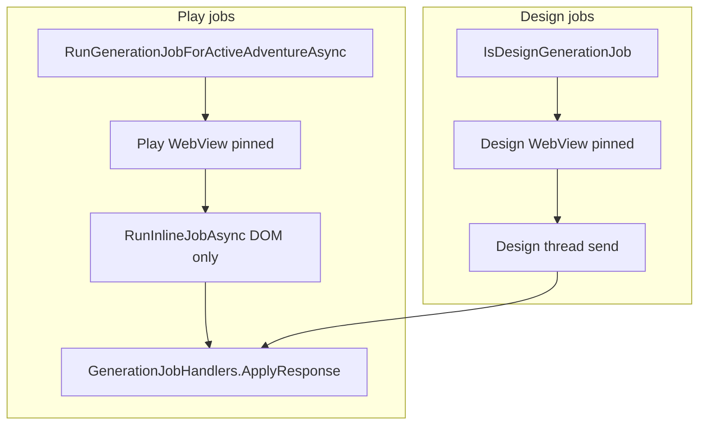

# Utility delivery pivot (CMD-248)

Architecture decision record for retiring dedicated utility threads in favor of play-inline and design-thread delivery.

## Context

Dedicated per-job utility threads (`UtilitySessions[jobId]`, hidden utility WebView, readiness probe, utility tab dual-pin) fail too often in real ChatGPT sessions — unregistered conversations (403/DomOnly), stale reconcile, seed send failures, and play/utility thread confusion.

Parent epic: [CMD-248](https://linear.app/cmd0112/issue/CMD-248) · Spike: [CMD-249](https://linear.app/cmd0112/issue/CMD-249).

## Decision

**Retire dedicated utility threads.** All generation jobs route to one of two surfaces:

1. **Play inline** — runtime jobs on the pinned play thread via DOM (`RunInlineJobAsync`).
2. **Design thread** — design-time and source-editing jobs on the pinned design thread.

No hidden utility WebView, no utility tab pin, no per-job `[CGW:memory]` / `[CGW:entity]` threads.

## Target architecture

## Job routing matrix

| Job ID | Surface | Send path |
|--------|---------|-----------|
| `process_turn` | Play inline | `RunInlineJobAsync` |
| `extract_entities` | Play inline | `RunInlineJobAsync` |
| `expand_entity` | Play inline | `RunInlineJobAsync` (maps to extract_entities guide) |
| `propose_memories` | Play inline | `RunInlineJobAsync` |
| `update_summary` | Play inline | `RunInlineJobAsync` |
| `bootstrap_lore` | Play inline | `RunInlineJobAsync` |
| `expand_story_card` | Play inline | `RunInlineJobAsync` |
| `bootstrap_sections` | Play inline | `RunInlineJobAsync` |
| `expand_section` | Play inline | `RunInlineJobAsync` |
| `continuity_check` | Play inline | `RunInlineJobAsync` |
| `synthesize_source` | Play inline (Design mode: design WebView) | Context-dependent WebView |
| `design_adventure` | Design thread | `RunDesignJobAsync` |
| `design_extract_step` | Design thread | `RunDesignJobAsync` |
| `draft_framework` | Design thread | `RunDesignJobAsync` |
| `propose_json_import` | Design thread | `RunDesignJobAsync` (no seed) |
| `propose_source_edits` | Design thread | `RunDesignJobAsync` (no seed) |
| `generate_recap` | N/A | Obsolete — local `RecapFormatter` only |

## Deprecation

### Remove after migration

| Component | Path |
|-----------|------|
| Hidden utility WebView | `MainWindow.UtilityWebView.cs`, `HiddenUtilityWebView` in XAML |
| Readiness probe | `UtilityConversationReadinessService.cs` |
| Utility tab pin | `PlayTabPinService` utility methods, Session tab UI |
| Per-job session orchestration | `GenerationUtilitySessionService` (play jobs) |
| Delivery mode enum | `UtilityDeliveryMode`, `UtilityDeliveryModeService`, `InlineUtilityPipeline` |
| Utility thread kind | `AdventureThreadKind.Utility` in thread registry |

### Keep unchanged

- Parse/apply pipeline: `GenerationJobHandlers`, `PendingReviewService`
- Inline DOM send: `SubmitUtilityJobAsync`, `[[cgw:utility:…]]` tagging
- Thread registry for Play and Design active pins

## Migration

On adventure load (`AdventureMetadataMigration`):

- `UtilityDeliveryMode.SeparateThread` → `InlinePlayThread`
- Orphan `UtilitySessions` keys (non-`design_adventure`) ignored; stripped on save after Phase 5
- `PinnedUtilityTab*` cleared

## Seed policy

| Surface | Seed behavior |
|---------|---------------|
| Play inline | No per-job utility seed; job packet includes inline guide only |
| Design thread | Seed on new/empty design thread via design start packet; source jobs (`propose_json_import`, `propose_source_edits`) skip seed |

## Post-turn auto jobs

Re-enable `GenerationJobScheduler.GetJobsAfterTurn` for inline mode — auto extract, memories, summary, continuity run after play turns when settings enable them.

## Binding

Play and design conversation ids must flow through `AdventureThreadRegistryService` (CMD-252). Legacy singleton fields remain synced during rollout.

## Out of scope

- [CMD-43](https://linear.app/cmd0112/issue/CMD-43) hidden packet injection
- New generation job types

## Implementation phases

| Phase | Issue | Deliverable |
|-------|-------|-------------|
| 1 | CMD-249 | This ADR |
| 2 | CMD-250 | Play inline-only routing + UI cleanup |
| 3 | CMD-251 | Design thread absorption |
| 4 | CMD-252 | Registry binding hardening |
| 5 | CMD-253 | Infrastructure retirement + docs |

## Related

- [utility-job-orchestration.md](utility-job-orchestration.md)
- [instruction-sources-paradigm.md](instruction-sources-paradigm.md)
- [adventure-thread-registry.md](adventure-thread-registry.md)
