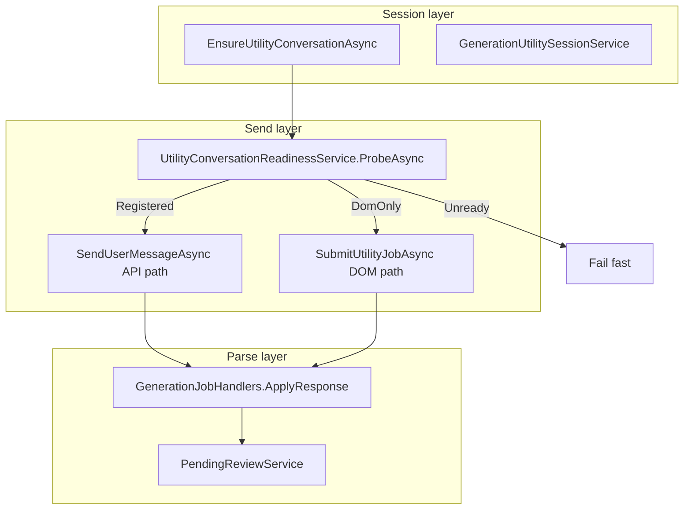
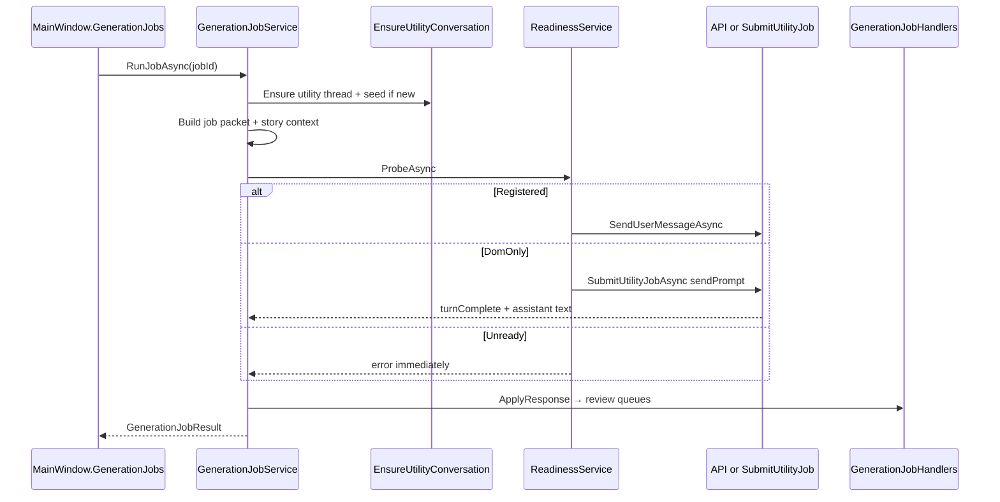

# Utility Job Orchestration (Phase 2c)

This document describes the **current** utility job pipeline — the major phased implementation that replaced the legacy `submitPrompt` + separate capture loop with play-style atomic turns, a readiness gate, and hardened session reuse.

**Related:** [instruction-sources-paradigm.md](instruction-sources-paradigm.md) · [services-reference.md](services-reference.md) · [adventure-panel.md § Generation jobs](adventure-panel.md#generation-jobs-phase-2) · [troubleshooting.md](troubleshooting.md)

---

## Overview

Generation jobs (`propose_memories`, `extract_entities`, `update_summary`, etc.) run in **per-job utility ChatGPT conversations** inside the linked Project — not on the play thread (unless **inline delivery** is enabled).

The orchestration stack has three layers:

---

## Session management

### Per-job threads

Each job type has its own `UtilitySessions[jobId]` entry on `AdventureMetadata`:

| Field | Purpose |
|-------|---------|
| `conversationId` | Utility `/c/…` thread |
| `sequence` | Thread number (`#n` in title) |
| `seedVersion` | Instruction guide version — rotation when changed |
| `jobCount` | Jobs run on this thread (max 50 → rotate) |
| `consecutiveParseFailures` | Max 3 → rotate |

Thread titles: `[CGW:{kind}] {Title} · {AdventureId:N} · #{sequence}`  
Prefixes: `[CGW:memory]`, `[CGW:entity]`, `[CGW:summary]`, etc.

### Session reuse (no spurious rotation)

**Problem fixed:** Client-bootstrapped utility conversations often do not appear in the project sidebar list immediately. The old pipeline archived sessions as `missing_from_project` and re-created threads every run (~30–60s overhead).

**Current behavior** (`GenerationJobService.EnsureUtilityConversationAsync`):

1. Reuse existing `UtilitySessions[jobId]` when present and not saturated.
2. **Reconcile** by title match via `GenerationUtilitySessionService.TryReconcileSession` when listing succeeds — updates `conversationId` if project list has a better match.
3. **Do not** discard a session solely because it is absent from the sidebar list.
4. Rotate only on: manual rotate, saturation (`jobCount` ≥ 50, seed version change, parse failures), or explicit reconcile to a different id.

### Delivery surfaces

| Mode | WebView | When |
|------|---------|------|
| **Hidden utility** (default) | Auto-managed hidden WebView | No utility tab pin |
| **Pinned utility tab** | User-pinned `/c/…` tab | Play settings → Session → utility pin |
| **Inline** | Play thread | `UtilityDeliveryMode.Inline` in settings |

Pinning a utility tab is recommended for **DomOnly** conversations (API returns 404 for client-bootstrapped threads).

---

## Readiness gate

Before every utility send (seed or job packet), `UtilityConversationReadinessService.ProbeAsync` classifies the utility WebView:

| Level | Meaning | Send path |
|-------|---------|-----------|
| **Registered** | Strict nav OK, bridge ready, `GET /conversation/{id}` succeeds | **API** when `PreferDomPlaySend` is false; otherwise **atomic DOM** (`SubmitUtilityJobAsync`) |
| **DomOnly** | Page OK, bridge ready, API fetch returns 404/429 (conversation exists in DOM only) | **Atomic DOM** — `SubmitUtilityJobAsync` |
| **Unready** | Nav failed, bridge down, composer missing, or non-DOM-capable API error | **Fail fast** — no send |

`PreferDomPlaySend` (default `true`, Play settings) forces the DOM path even when the conversation is API-visible.

### Probe steps

1. Rate-limit backoff check (15s after `http_429`)
2. `EnsureOnProjectConversationStrictAsync` — navigate to `https://chatgpt.com/c/{id}` (project context when gizmo set)
3. `GetPageHrefAsync` — read `location.href` (avoids stale `core.Source`)
4. `EnsureUtilityBridgeReadyAsync` — adventure bridge injected and healthy
5. `FetchConversationAsync` — API visibility test
6. For DomOnly: `EnsureUtilityComposerReadyAsync` + composer health probe

DomOnly without a pinned utility tab may attach hint: *"Pin a utility Project tab for more reliable jobs."*

---

## Send paths

### API path (Registered)

Used when the utility conversation is visible to `GET /backend-api/conversation/{id}`.

1. Trace `utility_job_phase` → `send_api`
2. `EnsureUtilityParentReadyAsync` — parent/conduit cache
3. `SendUserMessageAsync` — streaming send, parsed response text returned directly

No separate capture loop.

### DOM path (DomOnly) — atomic turn

Used when the conversation is DOM-only (typical for client-bootstrapped utility threads).

`AdventureTurnService.SubmitUtilityJobAsync`:

1. Strict navigation (again)
2. Hard fail on `bridge_not_ready` (no phantom `promptSubmitted`)
3. `sendPrompt` in `adventure-bridge.js` — fill composer, submit, **wait for stable assistant** in one bridge operation
4. Await single `turnComplete` message with assistant text
5. Timeout: `ComputeUtilityJobTimeoutMs` — 120s default, up to 180s for large packets

This mirrors the **play turn** path (`sendPrompt` → `turnComplete`), replacing the old:

- `submitPrompt` → `promptSubmitted` (fire-and-forget)
- 6× API poll (~12s)
- `captureStableAssistant` (up to 120s)

### Inline delivery

When `UtilityDeliveryMode.Inline`, jobs run on the **play thread** via `SendInlineUtilityPacketDomAsync` → `SubmitUtilityJobAsync` on the play WebView (with `[[cgw:utility:…]]` tagging).

---

## Response parsing

### Null-safe JSON (job apply phase)

ChatGPT responses may include `null` in JSON arrays or `"message": null` in conversation trees.

**Hardening:**

| Component | Change |
|-----------|--------|
| `JsonElementParsing` (Core) | `TryGetObjectProperty`, `EnumerateObjectElements`, `GetStringProperty` |
| `ConversationStreamParser` | Skip null message nodes in stream/tree walks |
| `GenerationJobHandlers` | `ApplyProposeMemories`, `ApplyCardArray`, `ApplyProposeSourceEdits`, `ApplyContinuityCheck` iterate objects only |

### Response normalization

`GenerationJobHandlers.NormalizeCapturedJobResponse`:

- Strip markdown fences
- Unwrap `{ "memories": [...] }` style envelopes
- `ContextTagFormat.UnwrapUtilityJobResponse` for tagged inline utility replies

Parse failures increment `consecutiveParseFailures` on the utility session; three failures trigger rotation.

---

## Diagnostics

### Trace events

`play-send-trace.jsonl` — event `utility_job_phase`:

| Phase | When |
|-------|------|
| `readiness` | After probe — level, error, pageHref, domOnlyReason |
| `send_api` | API path chosen |
| `send_dom` | DOM atomic path chosen |
| `inline_send_dom` | Inline delivery on play thread |

### Persisted errors

`AdventureMetadata.UtilityJobLastErrors[jobId]` — last failure per job, shown in Play settings → Session.

---

## Error codes

| Code | Meaning | Typical fix |
|------|---------|-------------|
| `utility_page_not_ready` | Utility WebView not on target `/c/…` or composer missing | Wait for nav; pin utility tab; retry |
| `bridge_not_ready` | Adventure bridge not injected/responding | Refresh tab; restart app |
| `conversation_unregistered` | API fetch failed with non-DOM-capable error | Open Project tab; retry after ChatGPT loads |
| `rate_limited` | `http_429` on conversation fetch | Wait 15s; reduce job frequency |
| `submit_not_observed` | DOM submit not verified | Pin utility tab; ensure not on homepage |
| `capture_timeout` | `turnComplete` not received in time | Shorter packet; pin tab; check model still generating |
| `empty_response` | Turn completed but no assistant text | Retry; check utility thread in ChatGPT UI |
| `capture_premature` | Assistant text looks like streaming fragment | Retry (bridge waits for stable text) |
| `conversation_mismatch` | Conversation id drifted mid-capture | Rotate utility thread |
| `utility_seed_send_failed` | Seed prompt failed | See nested error (often `http_403` → open Project tab) |
| `utility_turn_service_required` | DomOnly path without turn service | Internal — should not surface in normal use |

Capture-class errors may append the pin hint: `(Pin a utility Project tab for more reliable jobs.)`

---

## Job run sequence (end-to-end)

---

## Testing

| Test class | Coverage |
|------------|----------|
| `UtilityConversationReadinessTests` | Registered/DomOnly/Unready, rate limit, DOM-capable errors |
| `UtilityConversationPageTests` | href matching, strict navigation |
| `UtilityResponseParseTests` | Response unwrapping, memory JSON |
| `InlineUtilityDomPipelineTests` | Inline DOM delivery |
| `GenerationJobServiceTests` | Packet building, error formatting |
| `JsonElementParsingTests` | Null-safe property helpers |
| `ConversationStreamParserTests` | Null node skipping in streams |

---

## Implementation files

| File | Role |
|------|------|
| `GenerationJobService.cs` | Orchestrator: session, readiness, send, apply |
| `UtilityConversationReadinessService.cs` | Readiness probe |
| `UtilityConversationPageService.cs` | Strict nav, `GetPageHrefAsync`, href verify |
| `AdventureTurnService.cs` | `SubmitUtilityJobAsync`, atomic DOM turn |
| `GenerationUtilitySessionService.cs` | Session reuse, reconcile, rotation |
| `GenerationJobHandlers.cs` | Prompts, parse, error classification |
| `JsonElementParsing.cs` | Null-safe JSON (Core) |
| `ConversationStreamParser.cs` | Stream parse hardening (Core) |
| `adventure-bridge.js` | `sendPrompt`, `captureStableAssistant`, `getAssistantTurnCount` |
| `PlaySendTrace.cs` | `utility_job_phase` events |

---

## Related documentation

- [INDEX.md](INDEX.md)
- [Troubleshooting — Utility jobs](troubleshooting.md#utility-job-failures)
- [WebView Bridges — sendPrompt](webview-bridges.md#adventure--play-bridge)
